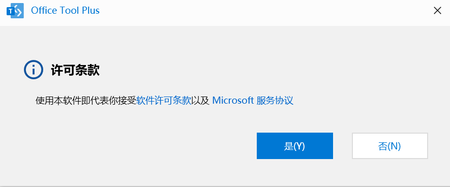
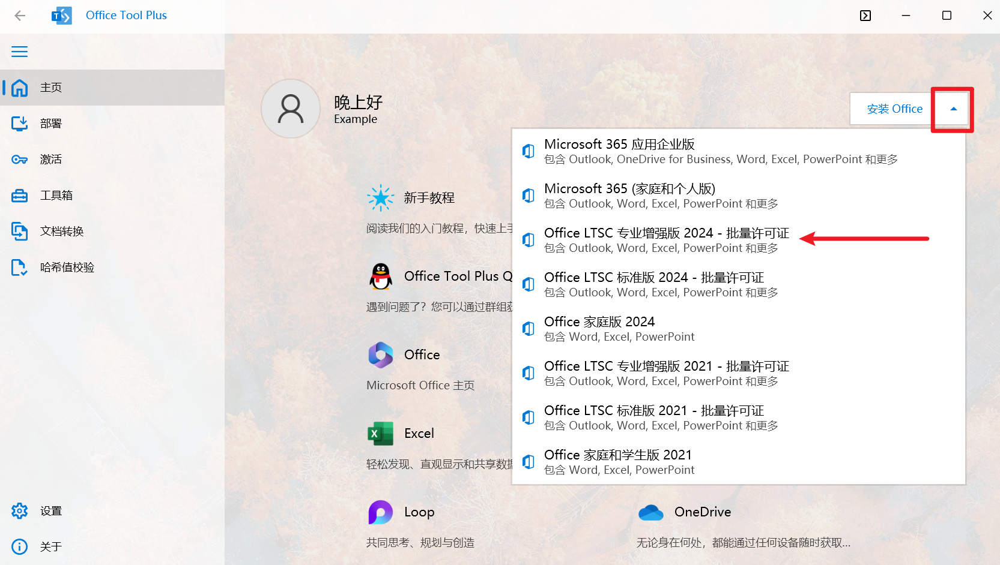
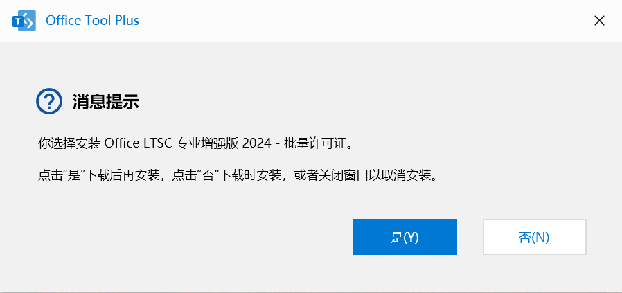
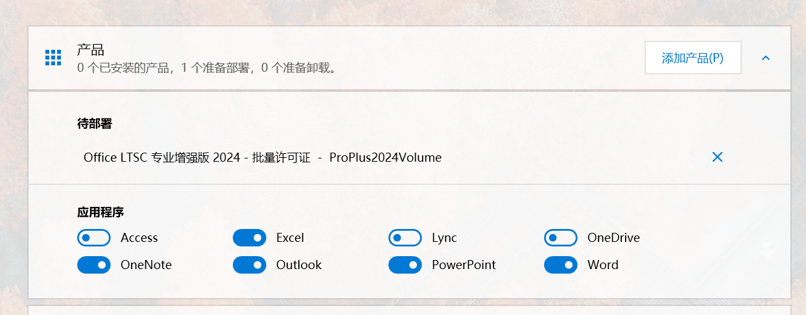
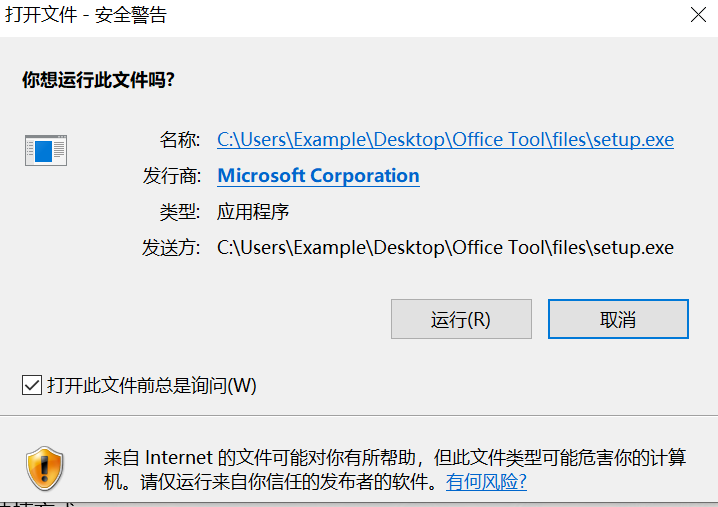
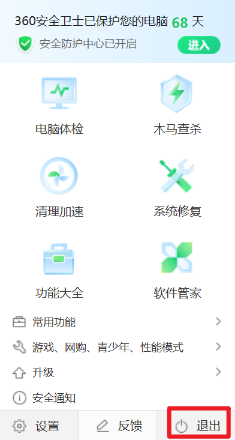
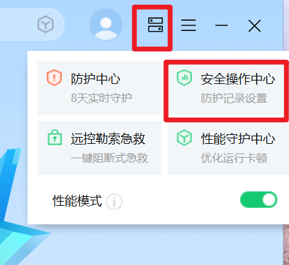
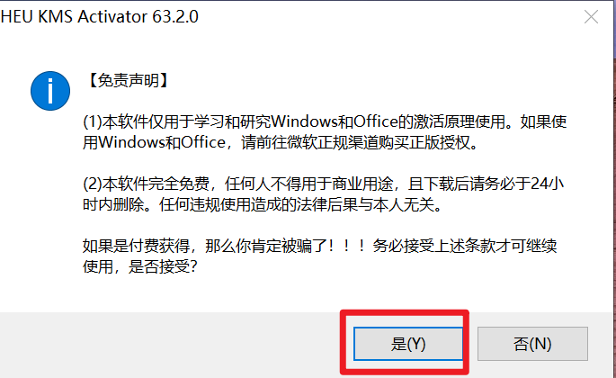
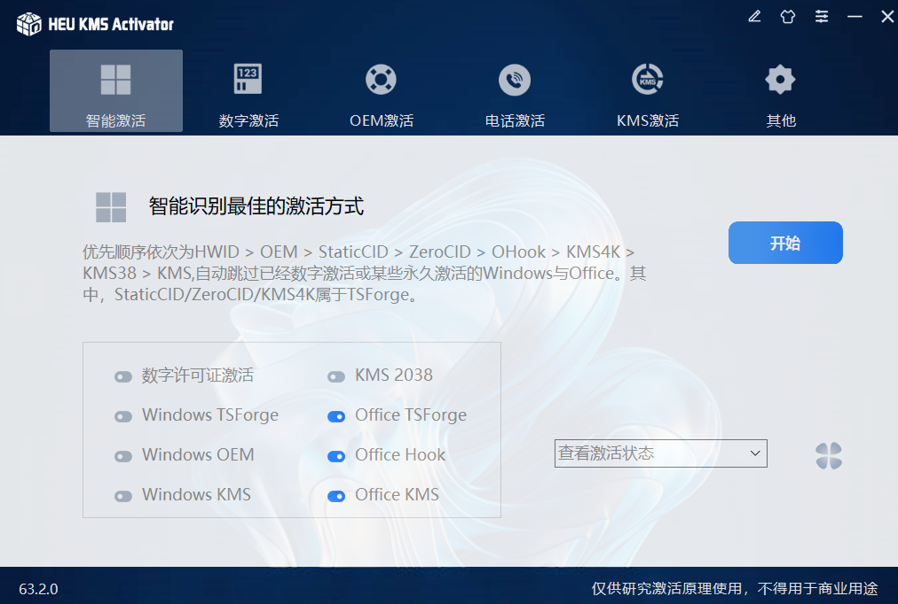

# 前言

本文主要针对重装完系统或者之前卸载过Microsoft Office但是现在想要把它再安装回来的情况。本文主要用到的工具是[Office Tool Plus](https://otp.landian.vip/zh-cn/)因为它的自定义化程度更高，可以避免安装一些不需要的东西，从office官网下载的安装包会直接默认安装全家桶。文章最后也会顺带提一下如何JiHuo office的问题。

本文中提到的软件仅供交流学习，不得用于商业用途，请下载后务必于24小时内删除。任何违规使用造成的法律后果与本人无关。

# 下载Office Tool Plus

复制链接并在浏览器中打开：https://otp.landian.vip/zh-cn/download.html

根据电脑实际情况选择，通常都是选择64位下载。网站这里给出了很多镜像站，选择其中一个下载即可（如果下载不了直接换别的）。

下载完后得到一个zip压缩包，解压到一个方便找到的地方，笔者这里直接解压到桌面。

找到文件夹中的

双击打开，可能会出现下图的提示

点击“运行”即可。

这时，程序会弹出一个许可协议框，点击“是”即可。

#  安装office

在“主页”选项卡中找到如图所示的小三角，点击后在下拉菜单中选择，如果已经购买正版或有许可证的微软账号请选择对应的版本，其他情况（你懂的）推荐选择图中箭头标识的版本

单击需要的版本后，会有如下弹窗，点击“否”即可（若网络环境较差可以选择“是”）。

在这个弹窗过后又会立马弹出来一个窗口，这里我们选择“否”，因为还需要做一些个性化设置。

下滑滚轮，在如图所示的界面停下，推荐按图中所示的进行勾选

*注：如果读者有使用OneDrive的需求，可以自行勾选，一般情况不建议安装*

其余默认，上滑滚轮，来到顶部，点击“开始部署”，然后在下图的界面中点击“是”

如果弹出下面的窗口，点击“运行”即可

然后稍等亿点点时间即可安装完成。安装完成后即可把刚解压出来的文件夹一整个删掉了，避免占用硬盘空间。

# 故障排查

还是在Office Tool Plus这个软件中，来到“工具箱选项卡”，它这里提供了很多强大的功能，根据实际情况进行使用即可。

# JiHuo你的Office

由于一些众所周知的原因，Office得JiHuo了才能用，所以这里提供一个方法供读者参考。需要用到的工具是[Releases · zbezj/HEU_KMS_Activator](https://github.com/zbezj/HEU_KMS_Activator/releases)读者自行下载即可。

下载后得到一个rar压缩包，解压至便于找到的位置。

**温馨提示：**该软件会被大部分安全软件误识别为病毒，临时关闭安全软件（包括defender）或者设为白名单（推荐）

## 关闭安全软件（这里以360为例）：

在任务栏右侧中找到360的图标，然后右键，在菜单中点击“退出”

然后在弹出的窗口中选择“我要退出1小时”然后点击“确定”

## 设置白名单（这里以360为例）

此方法与上面的二选一即可。根据下图所示打开：

然后切换至“已信任区”选项卡

然后将刚刚解压出来的文件添加至信任区。

## 开始JiHuo

双击打开软件后，会有如图所示的弹窗，点击“是”即可。

然后在下图的界面中取消勾选如图所示的选项

最后点击“开始”，期间可能软件会有风险操作，能允许的统统允许，能加进白名单的统统加。JiHuo完成后打开office检查一下，没问题了就可以把解压出来的文件删掉了。

**温馨提示：**使用该软件JiHuo可能会在电脑上留存一些必要的服务项，它们通常带有active、kms的字样，如果后续使用过程中安全软件对其进行了提示，统统允许即可。

# 结语

本文已经尽可能详细地阐述了操作流程，希望能够对读者有所帮助。本文中提到的软件仅供交流学习，不得用于商业用途，请下载后务必于24小时内删除。任何违规使用造成的法律后果与本人无关。