# 前言

在当今这个计算设备日益普及、硬件技术日新月异的时代，操作系统安装已不再是简单的"按几个按钮"就能完成的任务。随着UEFI替代BIOS成为主流引导方式，GPT分区表取代MBR，以及TPM 2.0、Secure Boot等安全机制的普及，系统安装的复杂性和技术门槛显著提高。回顾本系列文章的前两章，我们已经介绍了基础的系统安装流程，但这些内容显然无法满足现代用户对系统安装的全面需求。

在本系列主线文章的第三章中，我们虽然介绍了一种较为实用的UEFI引导系统安装方法，但内容相对简略，且仅针对UEFI引导系统。随着用户对系统定制化需求的增加，以及硬件平台的多样化发展，单纯依靠基础安装方法已无法应对各种复杂场景。例如，面对TPM 2.0限制的Windows 11安装、多格式系统镜像的处理、不同引导模式的兼容性问题，读者往往感到无从下手。

因此，本篇专题文章将全面深入地介绍系统安装的各个方面，不仅涵盖基础的安装流程，还将重点讲解UEFI与BIOS引导的差异、MBR与GPT分区表的原理、五种系统镜像格式的特点与应用，以及TPM 2.0、Secure Boot等安全机制对安装过程的影响。同时，文章将提供多种高级安装方法，包括PE系统中的高级安装技巧、Ventoy的灵活使用等，帮助读者在面对各种复杂硬件环境时都能轻松完成系统安装。

本文主要针对个人用户安装系统的需求，旨在提供实用、全面、易懂的安装指南，避免涉及面向企业需求的网络引导安装等复杂内容。我们相信，掌握这些知识不仅能帮助读者顺利完成系统安装，更能提升读者对计算机底层工作原理的理解，为后续的系统优化、故障排除打下坚实基础。无论是系统新手还是有一定经验的用户，都能从本文中获得有价值的信息。

---

# 基础知识

## UEFI(Unified Extensible Firmware Interface)与BIOS(Legacy)引导及其修复

计算机启动的"灵魂"——那些在你按下电源键后默默工作的幕后英雄。别以为启动只是"咔嗒"一声那么简单，这背后藏着计算机世界的哲学。

### BIOS：计算机世界的"老友"

BIOS（Basic Input/Output System）是1980年代诞生的引导系统，就像你家老式电表——简单可靠，但功能有限。

**它怎么工作？**
	 开机时，BIOS先执行自检（POST），检查内存、硬盘等硬件是否正常。然后，它从硬盘最开头的"小区域"（MBR，主引导记录）读取启动信息。MBR只有512字节大小，就像一张只能写100字的便签纸，装不下太多内容。所以系统必须分两步走：先读取MBR里的小引导程序，再由它加载真正的启动文件。

**关键特性：**

- **硬盘容量受限**：只能识别2TB以下的硬盘。如果你买了4TB硬盘，BIOS只能认出前2TB，剩下的空间就"看不见"了。
- **启动较慢**：必须按顺序检查每个硬件（比如"内存好了吗？硬盘好了吗？"），像在超市排队结账。
- **界面简单**：启动时全是黑底白字的命令行，你只能用键盘方向键"摸索"选项。
- **安全性较弱**：没有内置安全机制，恶意软件可能趁机混入启动流程。

### UEFI：计算机世界的"新伙伴"

UEFI（Unified Extensible Firmware Interface）是2000年代推出的现代引导系统，它不是"升级版BIOS"，而是重新设计的启动框架。

**它怎么工作？**
	 开机时，UEFI直接从硬盘的"分区表"（GPT，GUID Partition Table）读取启动信息。GPT是更智能的分区管理方式，能存储大量数据。UEFI还能在启动时调出"启动管理工具"（如EFI Shell），让你加载特定驱动或诊断程序——这就像手机开机时能直接点开"设置"应用，不用再翻找文件。

**关键特性：**

- **支持大容量硬盘**：能识别超过2TB的硬盘，理论上支持18EB（1800万TB）的存储空间。
- **启动更快**：能同时检查多个硬件（比如"内存和硬盘一起检查"），开机速度明显提升。
- **界面更友好**：提供彩色图形界面，支持鼠标操作，不用再用键盘"摸索"。
- **安全性更高**：内置Secure Boot功能，自动验证启动程序的数字签名，防止未授权软件启动——就像手机用指纹解锁，只让"对的人"进来。

| 特点         | BIOS                | UEFI                        |
| ------------ | ------------------- | --------------------------- |
| **启动方式** | 从硬盘开头的MBR读取 | 从硬盘的GPT分区表读取       |
| **硬盘容量** | 最多2TB             | 理论上支持18EB              |
| **启动速度** | 顺序检查硬件，较慢  | 并行检查硬件，更快          |
| **用户界面** | 黑底白字命令行      | 彩色图形界面，支持鼠标      |
| **安全性**   | 无内置安全机制      | Secure Boot自动验证启动程序 |

实际上，BIOS不是被"淘汰"了，仍在旧系统中使用。UEFI也不是"高大上"的替代品，它只是更适应现代硬盘和系统需求。

---

## MBR与GPT分区表

### MBR：

MBR，全称Master Boot Record（主引导记录），是计算机世界里的"老派地址簿"。它位于硬盘的第一个扇区（512字节的小空间），就像你家老式电话簿的第一页，只能写很少的信息。

**工作原理：**

开机时，BIOS会先读取这个小扇区，找到硬盘上的分区信息。MBR里包含两部分：启动代码和分区表。分区表只能记录最多4个主分区。

**特性：**

- **容量限制**：MBR只能识别2TB以下的硬盘。对于4TB的硬盘，MBR只能认出前2TB，剩下的就"看不见"了。
- **分区限制**：只能有4个主分区，或者3个主分区加1个扩展分区。
- **安全性低**：MBR没有内置的错误检查机制，如果这个小扇区坏了，整个硬盘可能就"失忆"了。

### GPT：

GPT，全称GUID Partition Table（全局唯一标识分区表），是MBR的"智能升级版"。它不再受限于512字节的小空间，而是采用更灵活的分区管理方式。

**工作原理：**

GPT把分区信息分散存储在硬盘的多个位置，就像把电话簿内容分散在多个小本子上。它使用UUID（全局唯一标识符）来标识每个分区，而不是简单的数字编号。

**特性：**

- **容量无限**：GPT理论上可以支持高达18EB（18×1024PB）的硬盘，这相当于能装下整个互联网的资料。
- **分区数量无限**：GPT支持几乎无限数量的分区，不再受4个主分区的限制。
- **数据安全**：GPT会在硬盘的开头和结尾都存储分区表副本，如果一个坏了，还有另一个可以救场。
- **更可靠的分区**：GPT包含CRC32校验码，能自动检测分区表是否损坏。

| 特点             | MBR                       | GPT                      |
| ---------------- | ------------------------- | ------------------------ |
| **存储位置**     | 硬盘第一个扇区（512字节） | 硬盘多个位置，有备份     |
| **最大硬盘容量** | 2TB                       | 18EB（理论上）           |
| **分区数量**     | 最多4个主分区             | 几乎无限                 |
| **分区表安全**   | 无备份，损坏即失效        | 有备份，损坏可恢复       |
| **启动方式**     | **与BIOS配合**            | **与UEFI配合**           |
| **现代系统支持** | 仅支持旧系统              | 支持Win8/10/11及现代系统 |

---

## ESD、WIM、ISO、SWM、GHO五种格式

### 一、ISO格式：光盘时代的数字复刻

ISO格式是计算机领域中最古老的系统封装格式之一，源自光盘存储技术。

**ISO文件本质上是一个光盘的完整数字复刻**，精确复制了光盘的扇区结构、引导程序和系统安装文件。这种封装方式起源于光盘刻录技术，最初设计目的是为了在无法直接访问光盘内容时，能够通过ISO文件完整还原光盘内容。

ISO文件采用基于扇区的存储方式，每个扇区固定为2048字节。其结构包含以下三个主要部分：

- **卷描述符集**：记录了光盘的基本信息，如卷标识符、卷大小等。
- **路径表记录**：允许快速定位目录结构，避免逐层遍历。
- **目录/文件记录**：详细描述了每个文件和目录的位置信息。

ISO格式的主要特点是**结构完整但体积庞大**。由于ISO文件不主动压缩数据，而是保留原始文件的大小和结构，一个典型的Windows 7 ISO文件约为3.5GB，而Windows 10/11的ISO文件则超过5GB。

这种设计使得ISO文件在跨平台兼容性方面表现出色，几乎所有操作系统都支持ISO文件的挂载和解压。然而，其缺点也很明显：体积大、传输效率低、不可直接修改。虽然可以通过工具提取和修改ISO内的文件，但修改后的ISO需要重新打包，过程较为繁琐。此外，ISO文件通常包含完整的安装程序和引导文件，导致文件结构复杂，难以针对特定需求进行定制。

**ISO格式最适合标准化分发场景**，如微软官方提供的系统安装光盘镜像。其完整的系统安装环境和稳定的结构使其成为系统安装的可靠选择，尽管体积较大，但在网络带宽充足的情况下，仍是部署Windows系统的首选方式之一。

### 二、WIM格式：微软的智能封装方案

WIM（Windows Imaging Format）是微软从Windows Vista开始引入的系统封装格式，**代表了微软在系统部署技术上的重大进步**。与传统的ISO不同，WIM采用基于文件的存储方式，专注于系统文件的高效存储和管理，不记录硬件信息。

**核心优势**：

- **智能压缩算法和单实例存储技术**：单实例存储（SIS）识别并合并重复文件，避免冗余。例如，两个相似Windows版本的共用文件只需存储一次。
- **高压缩效率**：采用LZMS压缩算法，压缩率显著高于传统格式。测试显示，Windows 7 x86系统：GHO镜像约4.46GB，WIM压缩至4.08GB（体积减少8.5%）。
- **多会话压缩支持**：允许多个系统版本或配置存储于同一文件中，仅计算不重复文件体积。

**灵活性**：系统管理员可在不启动系统的情况下，离线添加或删除驱动程序、系统更新和应用程序。这使企业能轻松维护标准化系统镜像，定期更新补丁而不必重新创建整个映像。例如，Windows 7系统更新从ISO转换为WIM后，维护时间从数小时缩短至几分钟。

**缺点**：

- 依赖微软工具，非Windows系统无法直接操作WIM文件。
- 单个WIM文件可能超过4GB，在FAT32文件系统上无法存储，需使用SWM格式分割。

**适用场景**：WIM格式最适合企业级系统部署和维护。IT管理员可利用其多映像支持和增量更新能力，创建标准化系统镜像库，简化多台计算机的安装和维护工作。WIM还支持将映像标记为可引导，允许直接从WIM文件启动计算机，大幅提升系统部署的灵活性。

### 三、ESD格式：微软的高效压缩方案

ESD（Electronic Software Distribution）是微软从Windows 8开始推出的系统封装格式，**代表了微软在压缩技术上的进一步突破**。作为WIM的压缩优化版本，ESD采用更高效的压缩算法，显著减小系统文件体积，压缩率远超WIM和ISO。

**核心优势**：

- **高压缩率**：测试数据显示，Windows 7 x86系统的WIM文件约4.08GB，ESD压缩至2.86GB（体积减少30%）；Windows 8.1系统中，ESD比WIM小约20%。
- **网络传输效率高**：适用于带宽有限的环境，大幅降低传输成本。
- **工作原理**：基于文件的存储方式（类似WIM），不记录硬件信息，专注于系统文件管理。
- **创新特性**：采用LZMS算法的改进版本，支持“半加密”以增强对非授权修改的防护，更适合官方软件分发。

**缺点**：

- **操作复杂**：ESD无法直接挂载或修改，需先转换为WIM格式（微软官方工具DISM从Windows 8.1 Update起支持ESD处理）。
- **压缩时间长**：压缩过程通常需数小时完成，影响效率。

**适用场景**：ESD格式最适合**网络分发和存储优化**。在需要频繁更新或远程部署的环境中，其高压缩率能显著提升部署效率，尤其适用于带宽受限的场景。

### 四、SWM格式：跨越存储限制的解决方案

SWM（Split Windows Imaging Format）是微软为解决WIM文件大小限制而设计的封装格式，本质上是WIM文件的分割版本，旨在应对FAT32文件系统的4GB单文件存储限制。

**核心机制**：

- **分割原理**：将大型WIM文件按指定大小分割为多个SWM文件（如`install.swm`、`install2.swm`），每个文件不超过4GB。
- **操作工具**：使用DISM或ImageX工具完成分割，例如命令 `imagex /split install.wim install.swm 600` 将文件分割为最大600MB的分卷。
- **部署要求**：所有分卷文件必须置于同一目录，并按顺序命名（如`install.swm`、`install2.swm`），否则无法正确还原。

**缺点**：

- **不可直接修改**：SWM文件组无法直接挂载或编辑，需先合并为WIM文件进行操作。
- **操作复杂性**：部署依赖特定命令行参数，增加管理难度。

**适用场景**：SWM格式最适合受限存储介质部署，如FAT32格式U盘（常见于启动盘要求）、CD光盘或多张DVD。微软官方推荐将SWM文件拆分为最大600MB的分卷，以适配主流存储设备的容量限制。

### 五、GHO格式：Ghost时代的系统封装遗产

GHO（Ghost Image）是由 Symantec（原 Norton）开发的系统克隆格式，**代表了早期基于磁盘镜像的“硬件绑定”部署理念**。作为磁盘或分区的完整快照，GHO 曾是批量装机时代的主流工具，虽已被 WIM、ESD 等现代格式取代，但在处理遗留系统或同构设备时仍具实用价值。

**核心优势**：

- **还原速度快**：直接写入分区数据，无需逐文件部署，10GB 系统通常几分钟内即可还原，特别适合本地或局域网环境。
- **操作极其简单**：用户只需选择源与目标分区，点击“还原”即可完成，无需理解驱动注入、Sysprep 或引导机制。
- **还原保真度高**：完整保留原系统状态，包括注册表、用户配置、引导记录甚至桌面布局，适用于故障快速回滚。

**缺点**：

- **硬件依赖性强**：镜像绑定原始硬件环境，换到不同主板、芯片组或显卡的机器上极易蓝屏或无法启动。
- **不可灵活编辑**：无法像 WIM 那样挂载修改；更新系统通常需还原 → 修改 → 重新备份，流程繁琐。
- **存储效率低**：不支持单实例存储，即使多台相同设备，也需保存多个几乎重复的 GHO 文件，浪费空间。
- **格式封闭**：为 Symantec 专有格式，依赖 Ghost 软件操作，缺乏开放工具链支持。

**适用场景**：GHO 格式最适合**同型号设备批量部署**或**老旧系统快速恢复**。例如为100台相同配置的教学机、POS终端装机，或维护仍在运行 Windows XP/7 的工控设备。但在跨硬件、云环境、安全合规或需频繁定制的现代部署中，其局限性显著，已**不再推荐作为主流方案。**

### 对比分析

| 特性       | ISO                | WIM                | ESD                | SWM               | GHO                  |
| ---------- | ------------------ | ------------------ | ------------------ | ----------------- | -------------------- |
| 基于技术   | 扇区级             | 文件级             | 文件级（压缩优化） | WIM的分割格式     | 磁盘/分区            |
| 压缩率     | 无压缩             | 多种               | 最高               | 与WIM相同         | 多种                 |
| 文件大小   | 最大               | 中等               | 最小               | 分割为多个小文件  | 中等                 |
| 可修改性   | 较低（需重新打包） | 高（支持离线编辑） | 低（需转换为WIM）  | 低（需合并为WIM） | 较低（需要专业工具） |
| 多映像支持 | 不支持             | 支持               | 支持               | 支持（继承自WIM） | 支持                 |
| 系统兼容性 | 跨平台             | 仅Windows          | 仅Windows          | 仅Windows         | 仅Windows            |
| 部署方式   | 解压或刻录         | 直接应用           | 转换后应用         | 合并后应用        | 直接应用             |
| 硬件依赖   | 无                 | 无                 | 无                 | 无                | 强硬件依赖           |
| 适用场景   | 标准化分发         | 企业部署维护       | 网络传输优化       | 跨越存储限制      | 同型号批量部署       |

---

## TPM 2.0

### 对安装系统的影响

TPM 2.0已成为现代操作系统安装的必要条件，特别是对Windows 11的安装具有决定性影响。微软已将TPM 2.0作为Windows 11安装的**强制要求**，这意味着没有TPM 2.0支持的设备将无法安装Windows 11。

在系统安装过程中，TPM 2.0主要影响以下两个方面：

- **安全启动**：确保只有经过数字签名的引导加载程序和操作系统内核能够运行，防止恶意软件在启动阶段植入系统
- **BitLocker加密**：利用TPM 2.0安全存储解密密钥，实现自动解锁加密硬盘，无需用户手动输入密码

对于用户而言，安装系统前需要在BIOS中启用TPM 2.0（通常在"Security"或"Advanced"菜单下），这是成功安装Windows 11的关键步骤。

### 安全方面的作用

TPM 2.0作为硬件级安全组件，提供多层面的安全保障：

- **密钥安全管理**：生成、存储和保护加密密钥，防止恶意软件窃取关键安全凭证
- **平台完整性验证**：记录系统启动过程中关键组件的哈希值，确保操作系统和应用程序在启动时未被篡改，有效防止Rootkit等高级恶意软件
- **数据保护**：通过BitLocker加密，即使硬盘被物理拆卸并连接到其他设备，未经授权的访问也无法获取加密数据
- **生物识别安全**：保护Windows Hello生物特征数据，防止生物特征信息泄露
- **远程证明**：允许设备向远程服务器证明其硬件配置和软件状态的完整性，对云安全和远程管理至关重要

根据微软数据，过去两年经历的恶意攻击中，有83%是针对固件的攻击，而TPM正是抵御这类攻击的关键防线。TPM 2.0通过提供独立于操作系统的安全环境，为用户构建了值得信赖的计算环境，是现代计算设备不可或缺的安全组件。

简言之，TPM 2.0不仅影响系统安装的可行性，更是构建系统安全防线的核心技术，为数据保护、身份验证和系统完整性提供了硬件级保障。

---

## Secure Boot

Secure Boot是UEFI安全机制，通过数字签名验证启动组件，防止恶意软件在引导阶段加载，提升系统安全性。它对引导系统的影响包括：Windows 7必须关闭以启动，Windows 10/11建议开启以保障安全，但会阻碍非签名系统（如Linux）的引导；开启后，引导U盘上的PE系统可能**无法启动**，需在BIOS中临时**禁用Secure Boot**才能使用PE进行系统维护或安装。

---

## OOBE

OOBE（Out-of-box experience，开箱体验）是Windows系统首次启动时的初始设置向导界面，用于**引导用户完成基本系统配置**。它包含语言选择、区域设置、网络连接、账户登录（微软账户或本地账户）、隐私设置等关键步骤。在Windows 11中，OOBE流程已优化为更加现代化的界面设计，融合了蓝色和淡蓝色主题。

最新更新中，微软强制在OOBE流程中连接网络时自动下载并安装关键驱动、安全补丁和系统更新，用户无法跳过这些步骤，以提升系统安全性和稳定性。Windows 11家庭版要求必须使用微软账户登录，而专业版允许创建本地账户。此外，微软还对"第二次开箱体验"（SCOOBE）进行了改进，使其从多屏体验简化为单屏操作，用户只需点击"全部接受"或"保留当前设置"即可完成相关设置。

---

## PE系统

Windows PE（Preinstallation Environment）是微软开发的轻量级Windows预安装环境，基于Windows NT内核构建，为系统部署、修复和硬件测试提供临时运行平台。与官方WinPE相比，第三方PE系统如**微PE、EasyU和USM**在功能扩展、界面优化和驱动支持方面具有显著优势，但各有其适用场景和局限性。本文将深入剖析Windows PE的核心概念，并对比分析主流第三方PE系统的特性与差异，帮助用户根据实际需求选择合适的PE工具。

在实际应用中，微软官方的WinPE功能相对基础，难以满足复杂的系统维护需求。因此，市场上出现了多种第三方PE系统，它们基于WinPE内核进行深度定制和功能扩展。以下是三款主流第三方PE系统的详细对比：

### 1. 微PE工具箱（WePE）

微PE工具箱是由国内开发者团队打造的轻量级PE系统，以"小而强大"著称。其最新版本（v2.3）基于Win10内核，64位纯内核仅155MB，完整版约227MB，是目前最轻量的第三方PE系统之一。

**技术特点**：

- 采用Win10内核，支持绕过TPM限制安装Windows 11
- 内置VMD驱动及最新IO驱动，完美适配11代以上Intel新机型及平板设备
- 支持四种部署方式：U盘/移动硬盘启动盘、生成ISO镜像、安装至本地硬盘、系统启动项集成
- 提供Unicode编码支持，解决外文系统乱码问题

**功能亮点**：

- 内置20余款精选维护工具，包括引导修复、注册表修复、病毒查杀等急救工具
- 数据管理工具如DiskGenius分区工具（支持GPT分区）、磁盘克隆和文件恢复
- 系统部署工具如WinNT Setup安装器（支持原版ISO安装）和Ghost备份还原
- 硬件检测工具如CPU-Z和HD Tune，以及Windows登录密码破解工具

微PE被广泛认为是"唯一敢放心用的纯净PE"，其零捆绑、彻底杜绝"流氓行为"的特点受到专业装机人员和系统维护工程师的青睐。2025年适配Win11的举措进一步巩固了其在行业内的标杆地位。

### 2. 优启通（EasyU）

优启通是由IT天空开发的专业U盘启动工具。它采用U盘三分区方案，将PE系统、启动引导和数据存储区域分开，提升数据安全性和系统稳定性。

**技术特点**：

- 双PE分治策略：内置Win10 PE和Win2003 PE系统，分别接管不同硬件范围
- PE区自动隐藏：U盘PE所在分区在系统下自动隐藏，防止病毒入侵，保障数据安全
- 支持BIOS与UEFI双启动模式，兼容主流硬件及多数旧硬件
- 提供扩展管理器（EXLOAD）：VIP版支持加载额外工具与驱动，满足专业用户需求

**功能亮点**：

- U盘模式：一键全新制作，支持免格升级，UD/EFI分区设置，个性化启动菜单，模拟测试功能
- 本地模式：将PE写入当前系统盘符，支持BIOS/UEFI引导，并可安装PE Tools/DLC扩展包
- 生成ISO：创建PE的ISO镜像文件，适用于量产、虚拟机使用，可自定义引导菜单样式
- 系统安装与维护：集成多种装机必备工具和IT天空自研软件，如系统更换、数据修复、清除开机密码等

优启通被定位为"一线装机技术员、系统工程师和系统维护人员"的专业工具，在广泛兼容性、稳定耐用性、快速启动和体积控制方面达到平衡。其VIP版提供更丰富的功能扩展，但普通版也保持了基本的实用性。值得注意的是，优启通普通版默认桌面浏览器主页有2345网址导航，但VIP版可完全去除这些元素。

### 3. U盘魔术师（USM）

U盘魔术师（USM）是由系统总裁网站开发的多功能PE工具，最新版本为v6系列（2025年9月更新）。USM提供三种主要版本：v3、v5和v6，每种版本针对不同系统需求设计。

**版本差异**：

- v3系列：03PE与Win8_PEx86及Win8_PEx64的组合，适用于老旧电脑维护场景
- v5系列：03PE与Win10PEx86及Win10PEx64的组合，对新系统的支持和兼容性更好
- v6系列：整合v3和v5的全部内容，并添加了Win7PEx86和Win7PEx64精简版，支持Win7-11全系列系统

**技术特点**：

- 内置或外置大量磁盘控制器驱动（IDE、AHCI、RAID、Nvme、USB3.0/3.1），支持全系列苹果本触控键盘操作和硬盘识别
- 支持多种安装模式：UD、UDM、ISO、安装本机、x86_efi及x64_efi
- 硬盘模式：可将PE系统永久安装在电脑硬盘上，无需U盘即可启动
- 网络支持：全能版支持网络、声卡、显卡、摄像头、打印机等设备驱动的安装调试，甚至可在PE环境下运行大型网络游戏

**功能亮点**：

- 映像总裁（SGI）安装器：支持原系统安装/备份还原/分区克隆和磁盘克隆
- 万能驱动库：自动识别并安装网卡/显卡等驱动，内置驱动工具如万能驱动助理
- 远程协助功能：在PE环境下连接网络后，可使用远程工具进行远程协助操作
- 硬件信息显示：支持PE下自动理顺盘符，并详细显示硬件信息

USM被描述为"功能最强大的PE工具"，其多版本组合策略能满足不同用户需求。v5系列通常被认为足够满足大多数场景，而v6系列则适合需要全面支持的维修人员。

***我个人更推荐使用优启通，当然也要备好微PE和USMv6，以防遇到特殊不兼容情况。***

### 制作PE系统U盘

这里以优启通为例，其它PE大同小异。

**温馨提示：**此操作会清空U盘中的所有数据，包括U盘其它分区。请务必提前把U盘里的文件备份好。

1.下载PE制作工具，这里我把官网贴出来了

[优启通 v3.7.2025.0326 - IT天空](https://www.itsk.com/thread/434043)

2.下载下来的是一个压缩包，解压后双击打开文件夹里面的“EasyU_v3.7.exe”文件

3.插入U盘，如图所示点击“全新制作”即可将PE写入U盘

4.稍等片刻即可

## 启动顺序设置

1.在U盘插入电脑的情况下开机，然后立即多次点按对应的快捷键，下图快捷键仅供参考，视具体情况而定，读者可自行必应对应的快捷键

2.选择U盘启动项，然后回车。注意：通常有“USB”字样，有些是U盘品牌名字

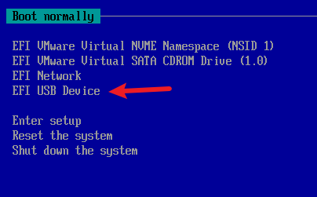

3.上下两个选项根据需要进行选择，直接按回车即可

3.再等一会，就能见到PE系统桌面了，进入桌面后还要等待一些模块加载，桌面图标都出来后就正常了

---

# 花式安装Windows系统

## 1.使用移动存储介质直接安装

**优势：**

-  操作简单
-  兼容性好

**缺陷：**

- 可自定义化程度较低
- 对于复杂分区处理不便
- 功能局限于安装系统
- 需要U盘

### 操作步骤：

**1.从官网下载工具**

在必应上搜索需要安装的系统，这里以Windows10系统为例。

点击下载Windows10媒体创建工具。

下载完成后打开它，并插入U盘（**请务必提前备份好其中的资料**）

**2.制作Windows10的安装U盘**

在这个界面有两个选项，上面那个选项用于覆盖并升级当前系统，下面那个选项用于创建Windows10的安装介质，我们选择下面那个选项。

这里可以取消勾选后，做一些版本选择，通常默认即可，然后点击“下一步”

在这个界面又有两个选项，前者用于创建Windows10的安装U盘，后者用于下载Windows10的ISO系统镜像文件，这里我们选择上面那个选项。

在列表处选中你的U盘，如果没有显示你的U盘，可以点击“刷新驱动器列表”。

这里的等待时间取决于你的网速和电脑性能，通常半个小时以内可以完成。耐心等待，不建议强制中断。

显示如下界面就说明完成了

**3.正式安装**

参考前面讲到的启动U盘中系统的方法，进入安装系统界面，默认即可，点击“下一页”，然后点击“现在安装”

如果你有购买正版密钥请输入，这里我们选择“我没有产品密钥”。

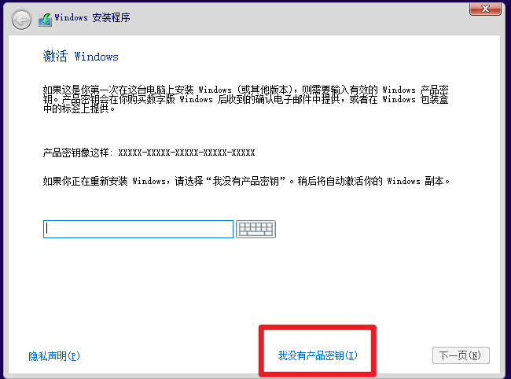

推荐选择专业版，如果电脑原本有已激活的Windows系统，请选择与其一致的版本，这样可以自动激活。

接受条款

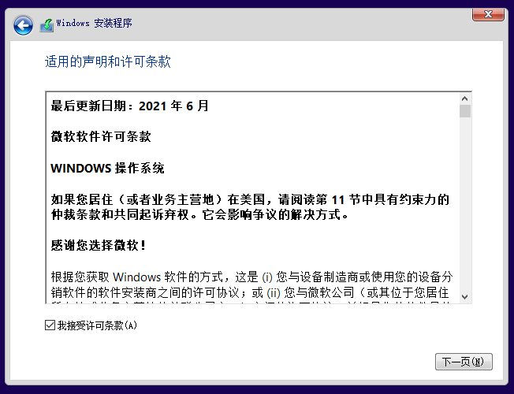

这里又有两个选项，如果你选择上面那个选项，相信我，你还会再回来的，建议选择下面那个选项

我们可以看到，这里列出了你硬盘的分区情况，如果是你自己的电脑可能会有其它更多的分区，但是我们需要删除的只有如图所示的四个分区

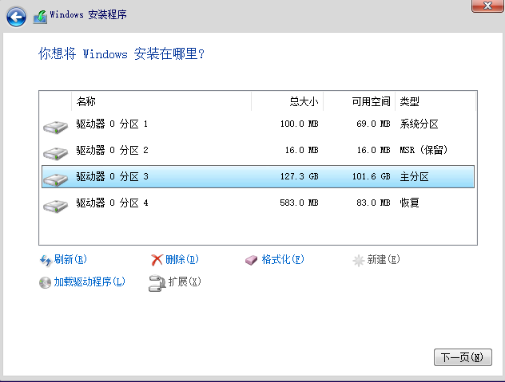

第一个分区时ESP（引导分区），第二个分区为MSR（保留分区），第三个分区是你原来系统所在分区，第四个分区是WinRE分区。这四个分区可以在选中后使用窗口中给出的“删除”按钮挨个删除掉。

删除完成后，选中刚刚删除空余出来的空间，然后点击“新建”，点击“应用”

这里会有一个弹窗，它的意思就是Windows要自己创建一些它需要的分区，点击“确定”即可。

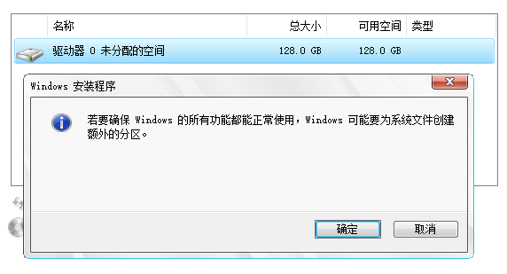

选中主分区，然后点击“下一页”

等待安装完成即可进入OOBE阶段了。

---

## 2.在PE系统中加载ISO镜像文件安装

**优势：**

-  可自定义化安装
-  兼容性较好
-  对于复杂分区处理方便
-  功能丰富

**缺陷：**

- 操作稍显复杂
- 需要U盘

### 操作步骤：

默认读者已经根据前面的知识制作好了一个**装有第三方PE系统**的U盘，在U盘中存放了要安装的ISO系统镜像文件，并成功进入了PE系统。

**1.使用PE系统中的硬盘分区工具进行分区**

做这一步的意义在于，如果你的硬盘分区比较复杂，在Windows安装界面中看起来难以区分，而在第三方分区工具中可以更加简单地区分分区，并准确地删除分区。

这里推荐使用DiskGenius，选中一个分区后，可以点击右侧的“浏览文件”查看分区中的文件，进一步确认是否是需要删除的分区。

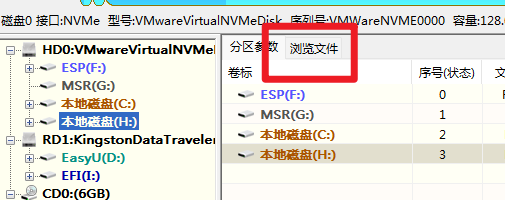

这里软件已经为我们标注了ESP和MSR分区，分别选中ESP和MSR分区后点击上方的“删除分区”。

上图中第三个分区没有明显标识，在查看其中的文件后可以确认是原系统所在分区（切勿仅通过盘符区分，PE系统下的盘符可能有所不同），采用同样的办法进行删除。

上图中第四个分区没有明显标识，在查看其中的文件后可以确认是原系统的WinRE分区，同样进行删除操作。

退出前记得点击上方的“保存更改”，使得我们刚刚的更改生效。

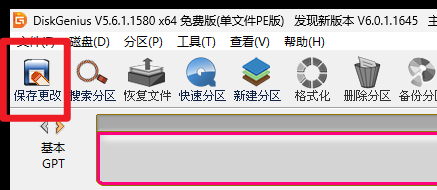

**2.挂载ISO文件**

在U盘中找到存放的ISO文件，右键以Windows资源管理器打开

双击运行里面的`setup.exe`文件

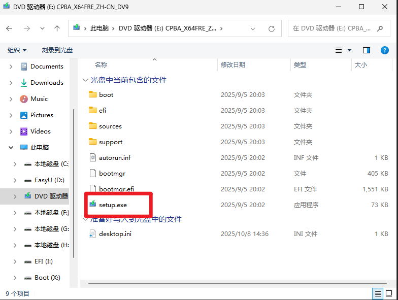

即可进入熟悉的界面了，后续步骤与上一种方法类似，这里不做过多赘述。

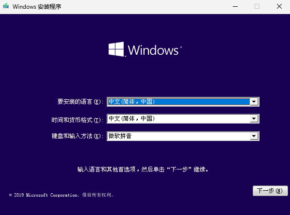

---

## 3.在PE系统中使用各类安装工具安装

**优势：**

-  兼容多种格式的系统镜像
-  对于复杂分区处理方便
-  功能丰富
-  可自定义化安装

**缺陷：**

- 可能会修改主页或者预装软件
- 需要U盘
- 操作较为复杂

### 操作步骤：

在进行后续操作前，需要读者严格按照前面所讲解的内容依次完成制作**装有第三方PE系统**的U盘、在U盘中存放了要安装的ISO系统镜像文件（不需要挂载）、成功进入了PE系统、删除了原系统的分区（并保存了更改）

**1.手动进行分区**

由于此方法不需要使用Windows安装程序了，也就没法依靠它自动创建好必要的分区。因此，我们需要手动创建好分区。

这里我们需要区分原系统是用的BIOS还是UEFI引导，通常**UEFI引导**的系统在删除原系统分区前可以看到其具有ESP分区，**并且**在DiskGenius对侧栏中的硬盘右键，可以看到“转换分区表为GUID格式”是灰色的（即说明硬盘是GPT分区表）。

通常**BIOS引导**的系统，在删除原系统分区前没有见到ESP分区，**并且**在DiskGenius对侧栏中的硬盘右键，可以看到“转换分区表为MBR格式”是灰色的。

对于**BIOS引导**的系统我们直接创建一个NTFS格式的主分区即可，对于**UEFI引导**的系统需要按照下面的操作进行

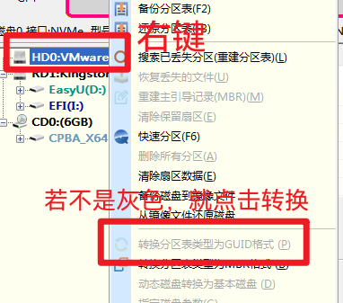

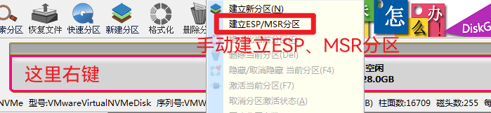

**2.使用第三方PE系统中的安装工具安装系统**

优启通中的系统安装工具是这个

打开它后会自动识别所有分区中的根目录中的系统镜像文件，支持的类型理论上包括ESD、WIM、ISO、GHO、SWM格式。

在右侧列表选择要安装系统的分区，在左侧列表选择要安装的版本，在顶部预览安装。

选择完成后，点击“一键恢复”，这里可以取消勾选自动运行万能驱动，因为我们没有准备该功能所需要的文件，然后点击“确认”。

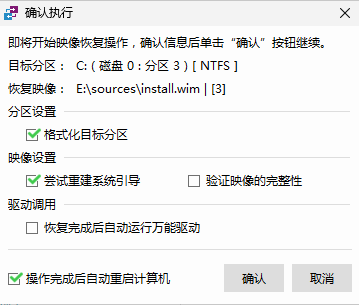

等待恢复完成即可直接进入OOBE阶段了。

---

## 4.使用Ventoy加载ISO文件安装

**优势：**

-  灵活性最佳
-  功能丰富

**缺陷：**

- 兼容性稍差
- 需要U盘

### 操作步骤：

**1.从Ventoy官网下载所需的工具**

[Download . Ventoy](https://www.ventoy.net/cn/download.html)

解压后，去到其中的altexe目录，将图中所示的两个x64文件复制到上一级目录中

然后双击运行

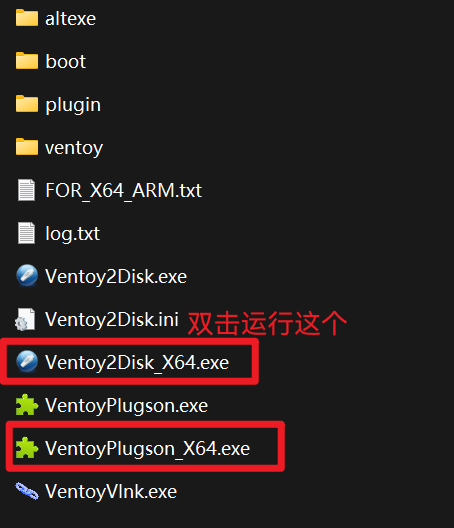

**2.制作Ventoy U盘**

在“配置选项”菜单中进行相应的设置，这里尽管勾选了安全启动支持，但是仍然会有部分电脑不支持，需要手动去BIOS中关闭Secure Boot，才能正常启动。

在上方选择好对应的U盘，然后点击“安装”

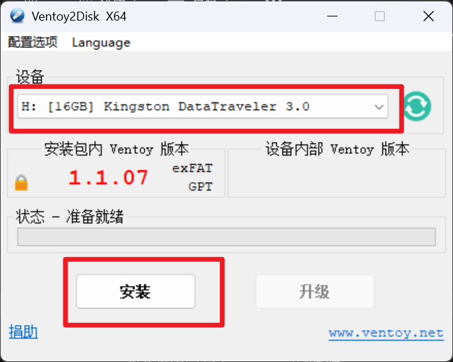

这里安装会非常迅速，接下来要做的就是往U盘里放系统镜像文件了，可以是第三方PE系统的ISO文件也可以是Windows系统的ISO镜像文件。当然它还可以支持其他更多的格式，若读者想要实现更加高级的用法可以参考**Ventoy官网**的说明。

笔者这里在U盘中存放了一个Windows安装镜像，一个优启通的ISO镜像

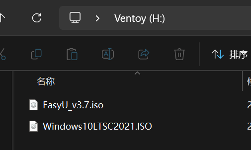

**3.进入Ventoy引导界面**

然后按照同样的方法引导进U盘，和之前有所不同的是，这里我们可以手动选择刚刚放在U盘中的系统

使用⬆️⬇️键选择其中一个了之后，按下`Enter`，会有如下界面

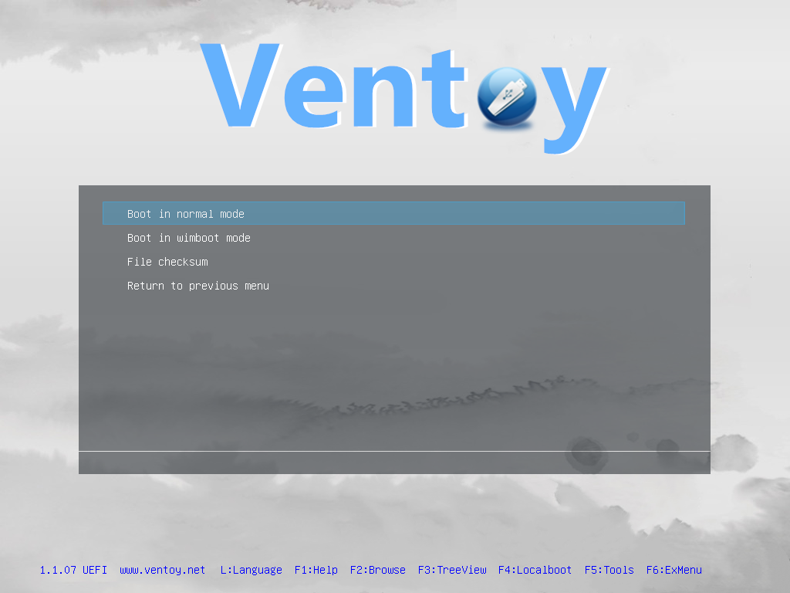

默认即可，按下`Enter`，即可正常引导对应的系统了。后续的操作参考前面三种方法，可以先引导进PE系统再安装（同第2、3种方法），也可以直接引导进Windows安装镜像直接安装（同第1种方法）。

---

## 5.使用ISO文件执行不保留数据安装

**优势：**

-  兼容性最好
-  不需要U盘
-  操作最简单

**缺陷：**

- 自定义化程度差
- 比较费时（真的很慢很慢）

### 操作步骤：

在系统中右键并装载事先下载好的ISO镜像文件

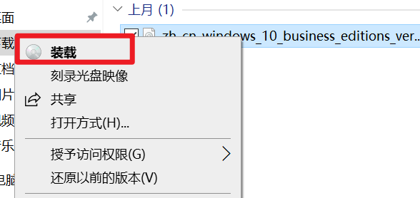

运行其中的`setup`文件

点击“下一步”

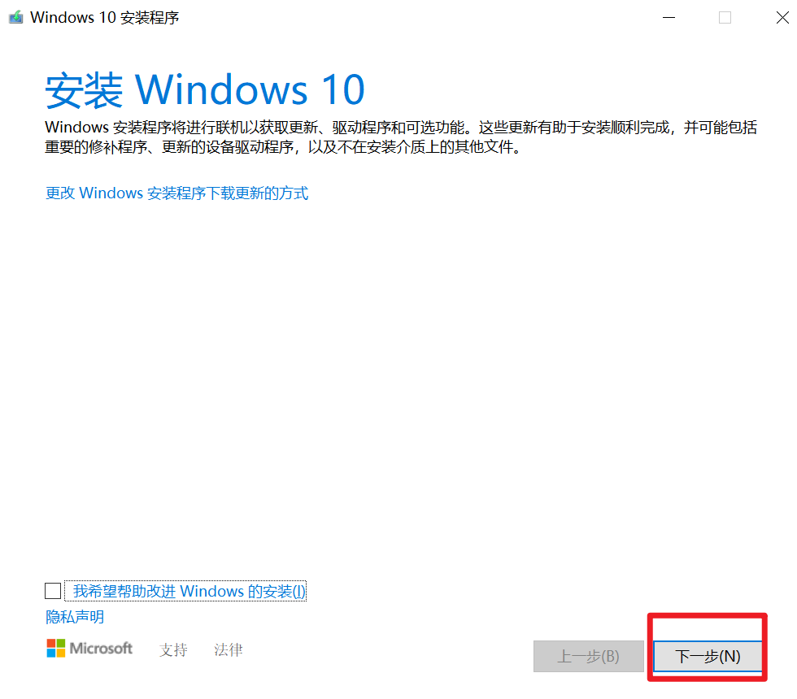

稍等片刻，这里选择“接受”

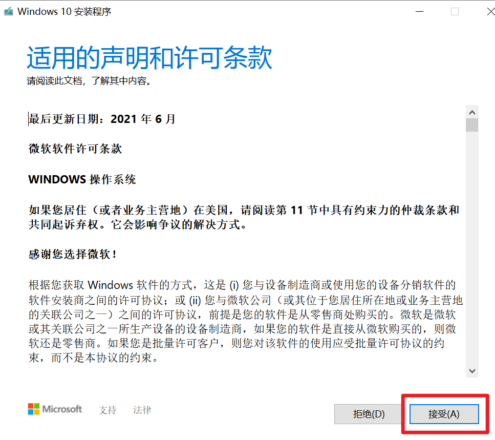

然后等待亿点点的时间（真的很久很久），如果读者已经从头到尾看到了这里，可以起来出去走走或者喝杯咖啡，放松一下。

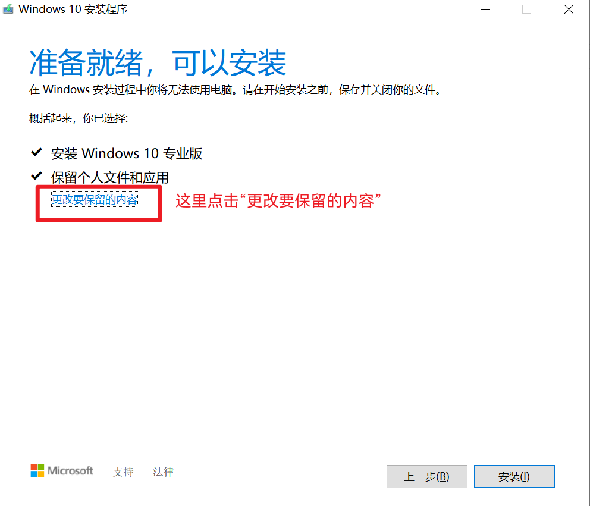

这里会给出三个选项，第二个选项没啥用，通常不会选。第一个选项就是默认的，它的作用在我之前有关修复系统的文章中提到，这里我们是要重装系统，所以选择第三个选项，不保留C盘中的任何数据（不会影响到其他盘）。

然后点击“下一步”，又是等待亿点点的时间。再次确认一下是不保留任何内容，点击“安装”

然后等待它自己安装完成，你就可以得到一个船新的系统了

---

# 自动化安装配置Windows系统

微软官方提供了比较详尽的[自动化Windows安装说明](https://learn.microsoft.com/zh-cn/windows-hardware/manufacture/desktop/automate-windows-setup?view=windows-11)，如果需要专业的精细化设置，可以参照说明配置应答文件。显然，这种办法有亿点点复杂，所以笔者这里提供一个比较简单的办法，去这个网站[Generate autounattend.xml files for Windows 10/11](https://schneegans.de/windows/unattend-generator/) 。然后根据下图的步骤进行个性化定制，下图中提供的配置方案仅供参考，读者可以根据需要自行抉择。

---

## 一、制作自动应答文件

**1.地区和语言设置（Region and language settings）**

`Windows features like Settings and File Explorer will appear in this language. It must match the language of your Windows 10/11 .iso file.`

`Windows 的“设置”和“文件资源管理器”等功能将以该语言显示。它必须与你的 Windows 10/11 ISO 文件的语言一致。`

`Select one or more languages in order of preference. The first language will also determine the initial **regional format**, which defines how numbers, dates, times and currency are formatted. You can change the regional format later.`

`请按偏好顺序选择一种或多种语言。首选语言还将决定初始的区域格式，该格式用于定义数字、日期、时间和货币的显示方式。您稍后可更改区域格式。`

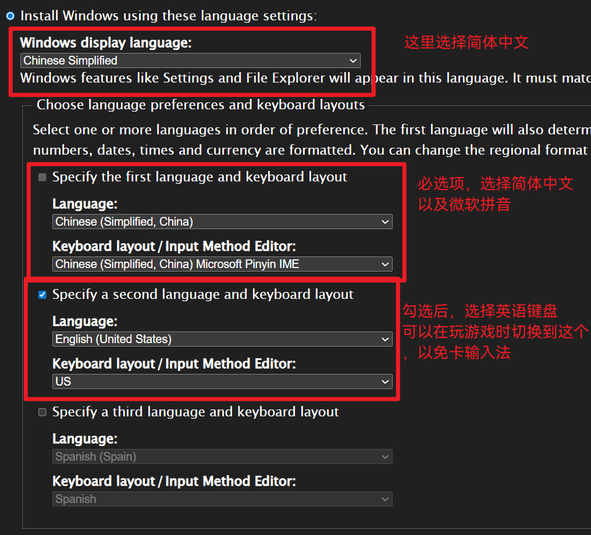

这里选择美国，这样可以避免一些针对中国地区的应用。比如应用商店中的应用宝

**2.处理器架构（Processor architectures）**

`When you select multiple processor architectures, a single autounattend.xml file will be created that is applicable to all of these architectures.`

`当你选择多个处理器架构时，将创建一个适用于所有这些架构的自动应答文件 autounattend.xml。`

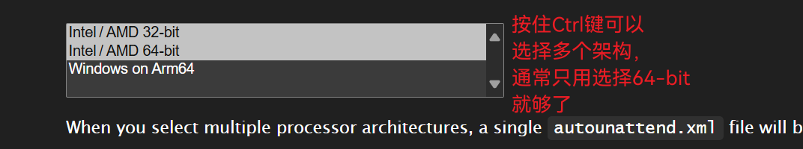

**3.设置选项（Setup settings）**

`Bypass Windows 11 requirements check (TPM, Secure Boot, etc.)`

`绕过Windows 11要求检查（TPM、安全启动等）`

这个选项根据需要勾选即可，笔者这里没有这个需求，就没有勾选。

`Allow Windows 11 to be installed without internet connection`

`允许在无网络连接的情况下安装Windows 11`  

该选项可以避免Windows11在OOBE阶段联网后进行的自动更新操作，大大缩短OOBE阶段浪费的时间。

`Hide any PowerShell windows during Windows Setup`

`在Windows安装过程中隐藏所有PowerShell窗口`

这个选项会让你的自动化安装过程更加的优雅，根据需要选择即可。

`Keep sensitive files`

`保存敏感文件`

这个选项会在你的C盘存放一些安装系统用的应答文件，通常并不需要保留。

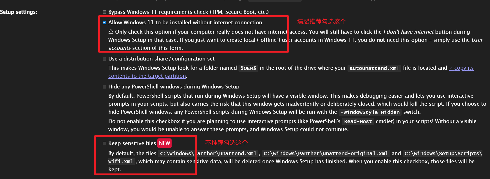

**4.计算机名称（Computer name）**

`Let Windows generate a random computer name like DESKTOP-ZFAH8Z2`

`让Windows生成一个随机的计算机名称，例如DESKTOP-ZFAH8Z2`

推荐勾选这个选项，另外两个选项需要自定义设置，通常没有这样的必要。

**5.精简 OS（Compact OS）**

精简 OS （是的，这是微软官方的翻译）将操作系统文件作为压缩文件安装。 基于 UEFI 和基于 BIOS 的设备都支持精简 OS。

运行精简 OS 时，Windows 更新可根据需要替换或删除单个文件，以帮助将驱动器占用空间始终保持在一定的大小。

具体详情参考[精简 OS、单一实例和映像优化 | Microsoft Learn](https://learn.microsoft.com/zh-cn/windows-hardware/manufacture/desktop/compact-os?view=windows-11#size-comparisons)

这里笔者图省事儿，选择让Windows自行判断是否需要Compact OS

**6.时区（Time zone）**

`Let Windows determine your time zone based on language and region settings`

`让Windows根据语言和区域设置自动确定您的时区`

`Set your time zone explicitly`

`明确设置您的时区`

`This is useful when your country or region spans multiple time zones, like Australia or the United States.Use this time zone:`

 `当您所在的国家或地区横跨多个时区时，这将非常有用，例如澳大利亚或美国。 使用此时区：`

通常让Windows自己确定时区即可。

**7.分区与格式化（Partitioning and formatting）**

通常**不建议**预先设定好分区，因为这往往不具有通用性，保持默认即可。到时候在安装阶段手动进行分区即可。

`Partition the disk interactively during Windows Setup`

`在 Windows 安装过程中以交互方式划分磁盘`

**8.Windows版本（Windows edition）**

`Use a generic product key`

`使用通用产品密钥`

`Such a key can be used to install Windows, but will not activate it. You can change the product key later.Install this edition of Windows`

`此密钥可用于安装Windows，但无法激活。您可稍后更改产品密钥。安装此版本的Windows:`

推荐选择这个选项，并使用专业版（Pro），专业版Windows功能较为完整。若需要在安装阶段手动选择版本，而非预先选好，可以勾选第三个选项。

**9.源映像（Source image）**

`Select image according to the product key`

`根据产品密钥选择图像：`

`Select image with this **index**:`

`使用此**索引**选择图像：`

`Select image with this **name**:`

`使用此**名称**选择图像：`

`Run Get-WindowsImage -ImagePath "install.wim" to learn the name and index of an image inside a .wim file.`

`运行Get-WindowsImage -ImagePath "install.wim"以了解.wim文件中的图像的名称和索引。`

通常为了较好的兼容性和通用性，默认第一个选项即可。

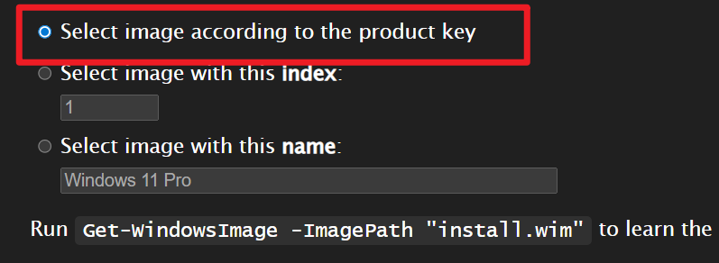

**10.Windows PE 操作（Windows PE operation）**

通常为了较好的兼容性和通用性，默认第一个选项即可，不建议自定义。

`Let Windows Setup (setup.exe) handle the Windows PE stage as usual`

`让Windows安装程序（setup.exe）照常处理Windows PE阶段。`

**11.用户账户（User accounts）**

`Let Windows Setup create the following local (“offline”) accounts:`

`让 Windows 安装程序创建以下本地（“离线”）账户：`

`Leave **Display name** empty unless you want it to be different from **Account name**.`

`除非您希望显示名称与账户名称不同，否则请将显示名称留空。`

`Several settings will only be applied when an administrator logs on for the first time. You should therefore let Windows log you on to an administrator account once – this does not affect subsequent logons. Choose which account to use for this:`

`某些设置仅会在管理员首次登录时应用。因此，您应让Windows将您自动登录到管理员账户一次——这不会影响后续的登录操作。请选择要为此使用哪个账户：`

`Logon to the first administrator account created above`

`登录到上述创建的第一个管理员账户`

`Activate built-in account Administrator and logon to this account. Set its password to`

`启用内置账户“管理员”，并登录该账户。将其密码设置为`

使用该账户具有众多优点，缺点只有一个。优点是避免了很多权限弹窗，以及因权限不够导致的诸多限制，账户名为英文，兼容性好。缺点是若使用该账户，那么Windows Hello功能中的人脸识别和指纹识别可能无法使用。若确要使用，需要手动新建一个普通的本地账户。

`Obscure all account passwords in your autounattend.xml file with Base64`

`使用Base64加密您autounattend.xml文件中的所有账户密码。`

`Add a Microsoft (“online”) user account interactively during Windows Setup`

`在 Windows 安装过程中以交互方式添加一个 Microsoft（在线）用户账户`

`Add a local (“offline”) user account interactively during Windows Setup`

`在 Windows 安装过程中以交互方式添加本地（离线）用户账户`

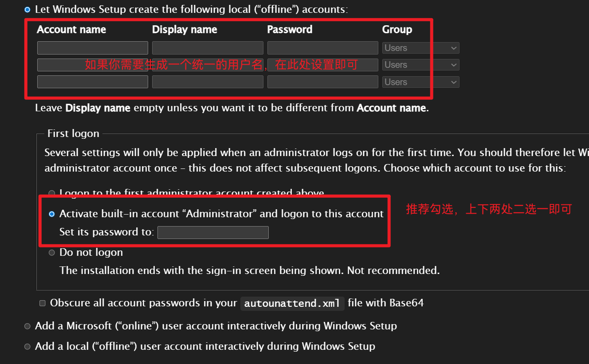

**12.密码过期（Password expiration）**

`Passwords do not expire`

`密码不会过期`

默认为该选项，不需要做任何更改。

**13.账户锁定策略（Account Lockout policy）**

`By default, Windows will lock out an account after **10 failed logon attempts** (threshold) within **10 minutes** (window). After **10 minutes** (duration), the account is unlocked automatically.`

`默认情况下，Windows 会在10分钟内（时间窗口）连续10次登录失败后锁定账户（阈值）。10分钟后（持续时间），账户将自动解锁。`

默认为该选项，不需要做任何更改。

**14.文件资源管理器调整（File Explorer tweaks）**

`Always show file extensions`

`始终显示文件扩展名`

`Use classic context (right-click) menu in Windows 11`

`在Windows 11中使用经典上下文菜单（右键单击）`

这两个选项可以根据个人需要进行勾选。

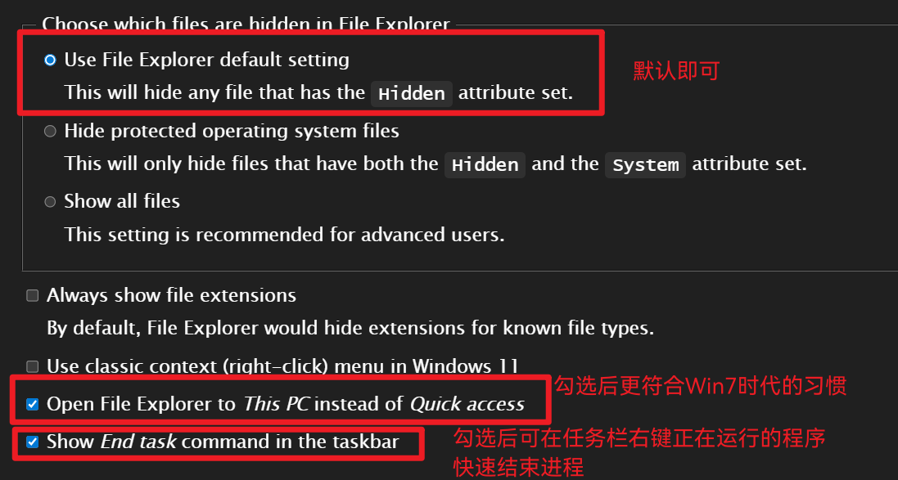

**15.开始菜单和任务栏（Start menu and taskbar）**

`Disable widgets`

`禁用小部件`

`Left-align the taskbar in Windows 11`

`在 Windows 11 中左对齐任务栏`

`Hide the *Task view* button from the taskbar`

`从任务栏隐藏“任务视图”按钮`

`Do not show Bing results when searching in the Start menu or the search box`

`在“开始”菜单或搜索框中搜索时，不要显示必应结果。`

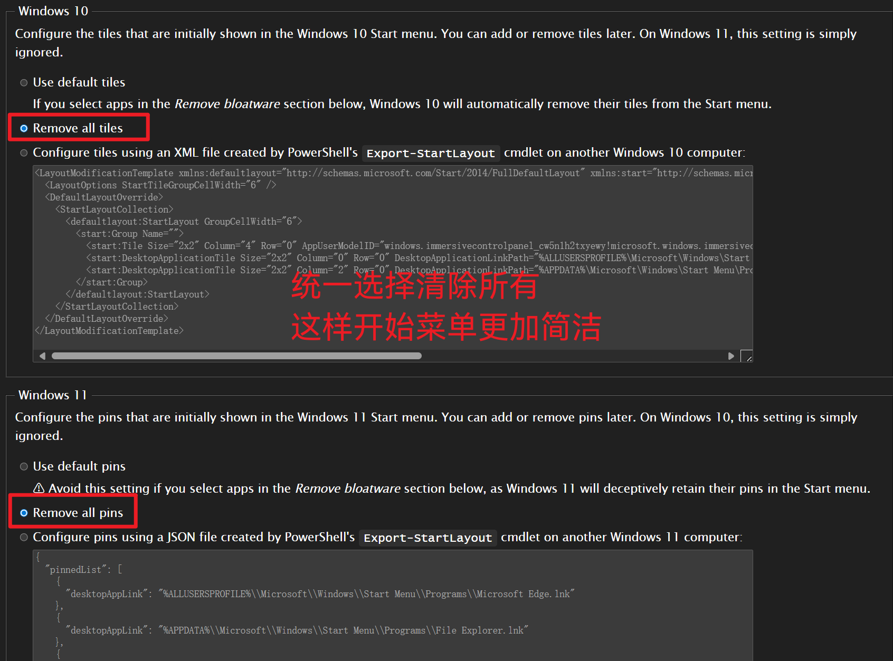

**16.★系统调整(System tweaks)**

`Disable Windows Defender`

`禁用Windows Defender`

推荐勾选该选项，该禁用方式不会影响系统稳定性，不会影响Windows系统的正常更新。

`Disable Windows Update`

`禁用Windows更新`

`This will create a scheduled task (named PauseWindowsUpdate) that pauses updates for one week again and again. If you want to run Windows Update for once, click *Resume updates* in Settings. If you want to enable Windows Update permanently, disable or delete that task.`

`这将创建一个名为“PauseWindowsUpdate”的计划任务，每隔一段时间便自动暂停更新一周。若想一次性运行Windows更新，可在设置中点击“恢复更新”。若希望永久启用Windows更新，则需禁用或删除该任务。`

推荐勾选该选项

`Disable User Account Control (UAC)`

`禁用用户账户控制 (UAC)`

墙裂推荐勾选该选项，这样每次打开应用时就不会有烦人的弹窗了。

`Disable Smart App Control`

`禁用智能应用控制`

没啥用，还挺烦人的，禁用。

`Disable SmartScreen in Windows and Edge`

`在Windows和Edge中禁用SmartScreen`

没啥用，还挺烦人的，禁用。

`Disable Fast Startup`

`禁用快速启动`

其实完全没有必要使用快速启动，现在的固态硬盘已经速度很快了。

`Disable System Protection / System Restore`

`禁用系统保护／系统还原`

禁用该选项后可以节约硬盘空间，当然也会损失还原功能。不过笔者由于使用的是第三方备份工具，不需要此功能。

`Enable long paths`

`启用长路径`

在一些特殊情况下可以提高系统的健壮性。

`Enable Remote Desktop services (RDP)`

`启用远程桌面服务 (RDP)`

不需要，默认不勾选即可。

`Harden ACLs`

`加强访问控制列表`

此举可防止无权限用户创建虚假文件夹，提升系统安全性。

`Allow execution of PowerShell script files`

`允许执行PowerShell脚本文件`

根据自己需要勾选即可。

`Do not update Last Access Time stamp`

`不要更新上次访问时间戳`

根据自己需要勾选即可。

`Prevent Windows Update from rebooting your computer`

`阻止Windows更新自动重启你的电脑`

很有用，得勾选上

`Turn off system sounds`

`系统声音默认静音`

如果你不想你在安装配置系统阶段电脑发出各种提示音的话就最好勾选上。

`Disable app suggestions / Content Delivery Manager、`

`禁用应用建议 / 内容交付管理器`
	没什么用，最好禁用咯

`Prevent device encryption`

`阻止设备加密`

墙裂推荐勾选该选项，新版Windows11系统会在系统安装阶段自动加密，然而普通用户的电脑并不需要加密。加密硬盘后反而会有很多麻烦的事情。

`Hide Edge *First Run Experience*`

`隐藏 Edge 首次运行体验`

`Disable Edge *Startup Boost* and *Background mode*`

`禁用Edge启动加速和后台模式`

这俩都建议勾选上，省事儿。

`Make Edge uninstallable`

`使Edge无法安装`

这个可能会导致一些问题，如果不是特别需要，最好不要勾选。

`Disable the *Enhance Pointer Precision* mouse setting`

`禁用增强指针精度鼠标设置`

增强指针精度鼠标设置是指在Windows操作系统中，通过调整鼠标的灵敏度、速度等参数来提高鼠标的精确度和响应速度。保持默认不勾选即可。

`Delete empty C:\Windows.old folder`

`删除空的C:\Windows.old文件夹`

可以勾选上，避免安装过程中Windows自己莫名其妙地创建了这个文件夹

`Audit process creation events`

`审计流程创建事件`

普通用户不建议勾选，可能会生成很多log。

**17.视觉效果（Visual effects）**

**18.桌面图标（Desktop icons）**

推荐按下图勾选

**19.“开始”中的文件夹（Folders on Start）**

`This setting has no effect on Windows 10. On Windows 11, the folders will appear on the Start menu as follows:`

`此设置对 Windows 10 没有影响。在 Windows 11 中，文件夹将按以下方式显示在“开始”菜单上：`

推荐按下图勾选

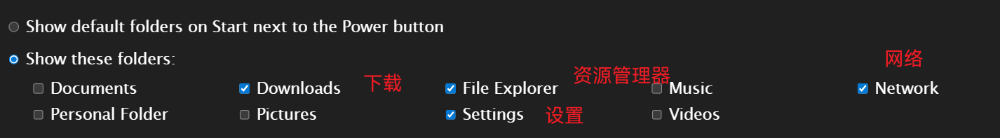

**20.WLAN/Wi-Fi 设置（WLAN / Wi-Fi setup）**

**21.粘滞键（Sticky keys）**

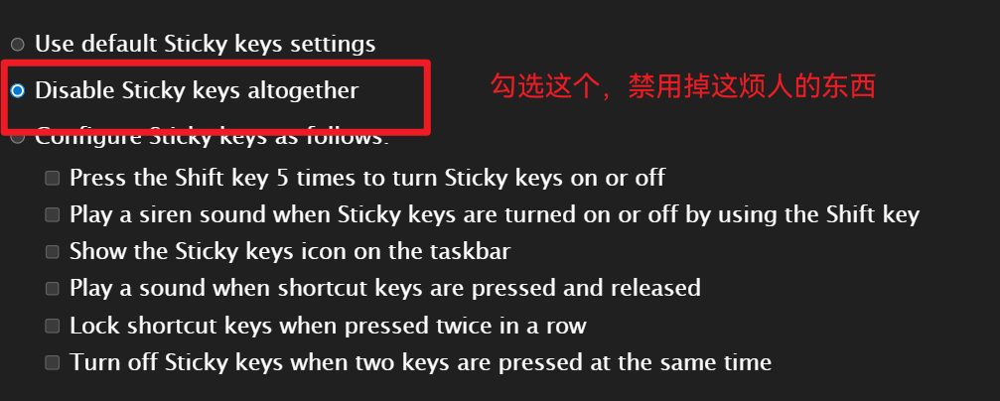

**22.移除臃肿软件（Remove bloatware）**

推荐按下图所示勾选，去除不需要的软件

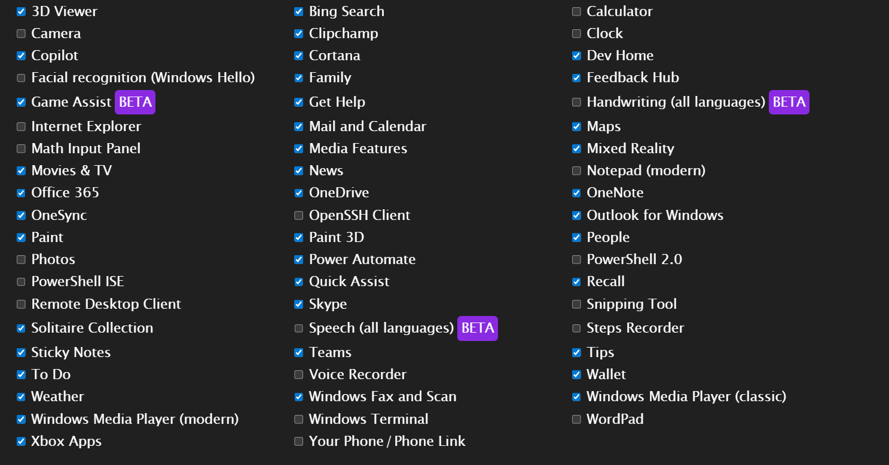

---

上述未提及的部分保持默认即可，也可以根据自己需要进行勾选和配置。

最后可以根据需要下载xml文件或者打包好的iso文件，iso文件通常用在安装虚拟机时比较方便。

---

## 二、使用自动应答文件安装系统

Windows 安装程序会**自动在多个位置搜索** autounattend.xml 文件，包括每个可移动驱动器的根文件夹。因此，使用自动应答文件的方式有很多。这里介绍一下比较常用的方法：

1.使用前面花式安装Windows系统的第1、2、4种方式安装系统时可以将autounattend.xml 文件放在移动存储介质（比如U盘）的根目录中。

2.使用前面花式安装Windows系统的第3种方式安装系统时，部分第三方安装工具支持手动选择自动应答文件（比如WinNTSetup）。

3.在虚拟机中需要自动化安装Windows系统时，可以挂载上Windows安装镜像后，然后再挂载上打包好的iso文件。

4.可以使用ISO编辑工具（比如UltraISO）修改Windows安装镜像，在根目录塞入autounattend.xml 文件，保存修改后即可获得一个自动化安装的Windows安装镜像。

---

# 封装一个自己的系统

这里需要特别说明一下，**封装系统**与**修改系统**的区别。**封装系统**指的是一个已经安装好的系统，在进行了一些修改操作或者安装了一些软件后，使用工具打包压缩好。**修改系统**指的是还未安装系统前对系统进行的一些修改，或者对安装好的系统进行的修改但没有打包压缩。上文写到的自动化安装配置Windows系统也算是一种修改系统的方法，实际上还有其它很多工具可以用来修改系统（比如NTlite），但是修改系统的学问实在是太深奥了，笔者能力有限，寥寥几笔实在无法写清楚。读者可以自行阅读小鱼儿、IT天空的相关文章进行深入学习修改系统的技艺，此处仅讲解如何封装系统。

**封装系统的意义：**在安装完系统后往往需要做一些重复的工作，比如安装微信、QQ、WPS、Office、安全软件之类的操作，而封装好做完了这些操作的系统后，以后安装系统就不用再做这些操做了。

**封装系统需要用到的工具：**一个带Dism++工具的PE系统、WimTool、VMware Workstation虚拟机、一个清理垃圾文件的工具

## 1.安装并完成配置系统

先参照前文的内容在虚拟机中安装并完成配置你要封装的Windows系统。这里建议在VMware中删除虚拟机的音频设备以及网络设备，而且不要安装VMware Tools。当然如果读者想以后每次安装封装系统都手动进行OOBE可以自行必应一下**Sysprep工具**的用法，这里不做过多赘述。

像上图这样尽可能少的设备即可。需要封装进去的软件可以使用U盘装载离线安装包运送进虚拟机中。

## 2.初步清理系统垃圾

在`设置->系统->存储`中把系统临时文件删除掉

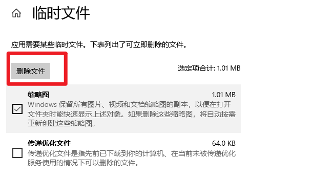

然后使用垃圾清理工具清理其它地方的垃圾，这里笔者使用的是腾讯电脑管家自带的清理功能。

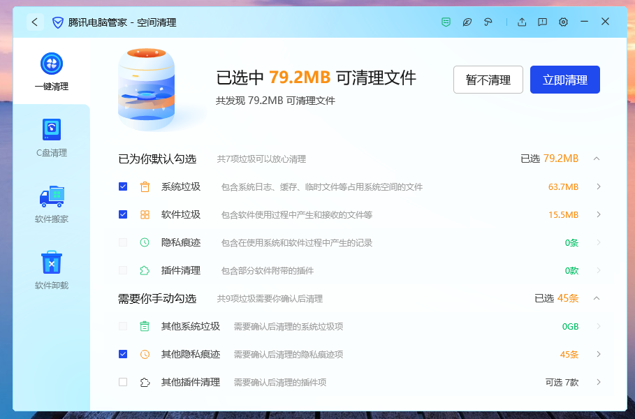

初步清理完成后，不要做任何其它操作，直接关闭虚拟机即可。

## 3.添加硬盘并进入PE系统

按下图步骤新增加一个额外的硬盘，中间的各种选项一路默认即可。

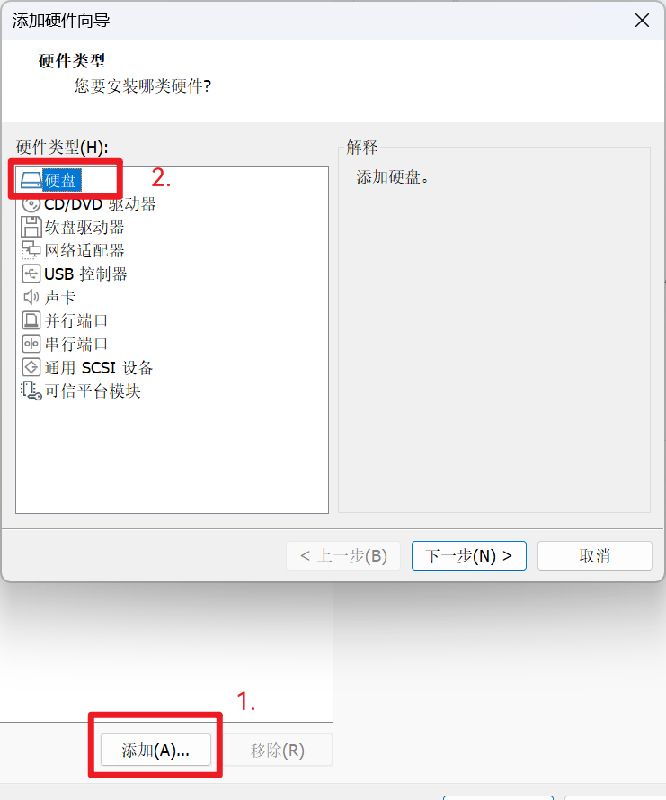

然后把**CD/DVD驱动器**那里改为挂载PE系统，这里笔者以**EasyU**为例。

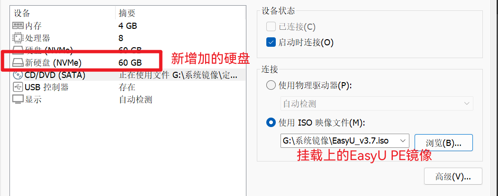

然后开机，点按ESC后选择引导进入PE系统。推荐选择后面带有分辨率标识的选项，这样可以避免进入PE后分辨率过大导致你狼狈地拖动侧边和底部的横条调整位置以操作。

先使用分区工具对刚刚添加的硬盘进行分区操作

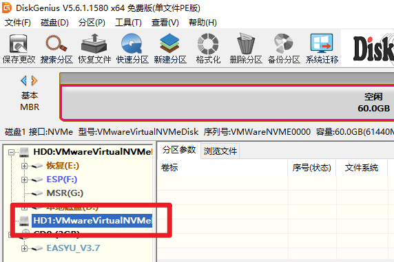

## 4.再次清理系统垃圾

打开PE系统中带有的**Dism++**工具，选择要封装的系统（显示为WinNT那个是你现在操作的PE系统）

在**空间回收**栏中勾选如下图所示的内容：

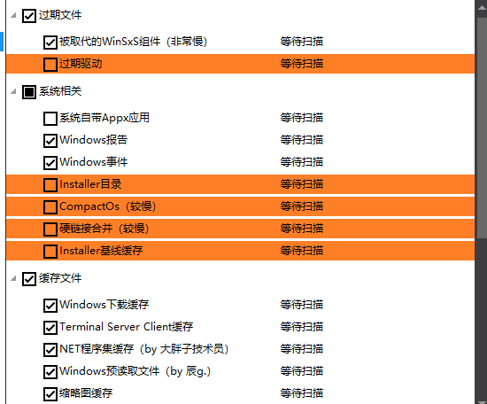

然后先点击**扫描**然后再点击**清理**

##　5.打包系统

在**工具箱**栏中选择**系统备份**，在如图所示的位置可以双击修改内容，但是不建议修改映像标志。在备份文件导出目录那里选择刚分区好的那个空硬盘，简单命名完成后选择wim格式，**不要选择esd格式**，因为你会发现esd格式导出很慢而且往往无法导出成功。最后点击确定后稍等一段时间即可。

## 6.从虚拟机导出系统

给虚拟机安装VMware Tools并重启虚拟机，找到我们新增那个硬盘的分区，可以看到封装好的系统文件

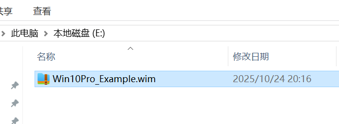

直接复制然后粘贴到你物理机的一个目录中

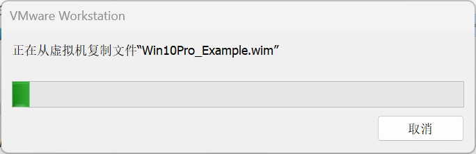

其实这时候你就已经可以继续使用**Dism++**工具把wim文件转为esd文件了，但是这不够硬核。

## 7.合并多版系统

还记得本章开头的基础知识部分讲到的wim格式文件的特性吗？

wim格式具有**多会话压缩支持**：允许多个系统版本或配置存储于同一文件中，仅计算不重复文件体积。

因此，若有制作多版系统，将它们合并在一起才是明智的选择。

这里我们就需要用到一个叫**WimTool**的工具，它提供了极其丰富的修改wim文件的功能。然而我们这里只需要用到图中标识出来的两栏的功能即可，其它高级功能读者可以自行探索。

我们先在**删卷和信息**栏中把对刚封装的系统进行详细命名，修改完成后点击右侧的**修改映像信息**即可保存修改。

按照上面的操作打包好其它版的系统。

然后在**新制和追加**栏中对多版系统进行合并，需要特别说明的是，这里的合并是指将其中一个映像添加到另一个映像中去，而非合并到另一个新的文件中。

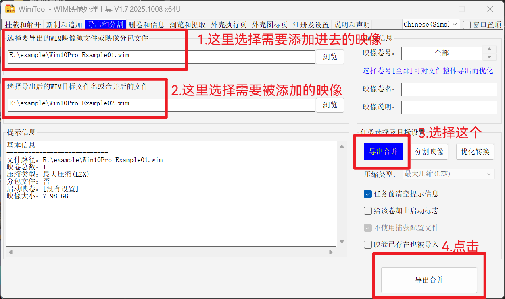

然后我们再次在**删卷和信息**栏中打开被添加的那个映像文件，可以看到已经多出来了一版映像

## 8.压缩文件缩小体积

经过封装的系统往往体积都会比原版系统大很多，为了便于网络传输或者Ｕ盘存储，可以将wim文件压缩为esd文件，并且集成其**多会话压缩支持**的特性。

再次打开**Dism++**，使用**WIM、ESD互转**工具，然后按下图所示选择对应的文件

哈哈哈哈，你不会以为到这里就结束了吧？

其实到这里足够了，但是这还不够硬核，请继续往下看。

## 9.合进ISO文件中

如果读者有经常安装虚拟机的需求或者习惯使用**花式安装Windows系统**中介绍的第1、2、4种方法安装系统的话，或许使用ISO文件应该更方便些。

打开**UltraISO**软件，找一个原版Windows的ISO文件打开。进入`sources文件夹`然后找到里面**原有**的那个`install.wim`文件。

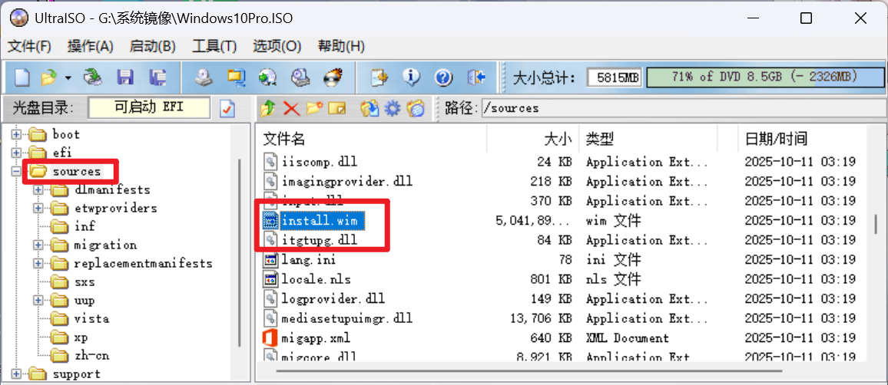

选中后使用`Delete键`删除该文件，然后拖入自己做好的**esd**文件，并改名为`install.esd`。这里替换为自己的wim也可以昂，依葫芦画瓢改名就行（不用更改后面的格式）。

最后在上方**文件**栏中把改好的映像另存为一个ISO文件，好了这下是真的完工了。

---

## 效果展示

这里笔者用之前做好的一个三合一典藏版Win10系统为例，最终的效果在官方安装程序中是这样的：

在第三方PE系统中的安装工具是这样的：

---

# 结语

通过本章的学习，我们系统地了解了现代系统安装的关键技术和方法。从UEFI与BIOS的差异，到MBR与GPT分区表的原理；从五种系统镜像格式的特点，到TPM 2.0、Secure Boot等安全机制的影响；再到多种安装方式的实践应用，我们已经构建了一个全面的系统安装知识框架。

在实际操作中，我们发现，掌握这些基础知识不仅能解决常见的安装问题，还能帮助我们应对各种特殊场景。系统安装不仅是一项技术活，更是对计算机工作原理的深入理解。随着硬件技术的不断发展，系统安装的方法也在不断演进。希望本文能够成为您系统安装道路上的得力助手，帮助您在面对各种安装挑战时游刃有余。

最后，我们鼓励读者在实践中不断探索和总结，因为只有通过实际操作，才能真正掌握这些知识。同时，也提醒大家在系统安装过程中注意备份重要数据，确保安装过程的安全与顺利。愿您在未来的系统安装与维护工作中，能够得心应手，享受技术带来的乐趣。
