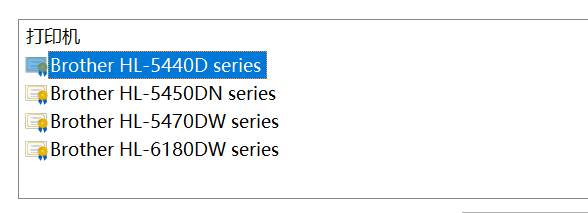

# 前言

在数字化浪潮席卷全球的今天，打印机作为连接虚拟与实体世界的重要桥梁，依然在办公、教育、创意等领域发挥着不可替代的作用。从针式打印到激光喷墨，从黑白单页到全彩高速，打印机的演进不仅折射出技术的进步，更深刻影响着我们的工作方式与生活效率。本文将带读者深入探索打印机的**连接、使用、维护**三个方面。本文将主要以HP Smart Tank 518打印机为例，其他类型的打印机大同小异，相信读者通过查阅说明书亦可轻松搞定。

# 连接打印机的三类常规方式

## 有线连接

这是每一台打印机必备的连接方式，只需要用一根线插在电脑USB接口上，然后绝大部分打印机都能被识别然后**自动装上驱动**。以Windows 10系统为例，在使用有线连接接上电脑后，在系统中顺次打开 `设置->设备->打印机和扫描仪`。通常能够看到打印机已经出现了，如果没有看到显示出打印机，那就点击上方的**加号**手动添加打印机即可。

对于过于老旧无法识别的打印机，需要手动去官网下载安装驱动。如果运气较好，打印机对应的驱动程序是exe文件，双击运行后一路默认就可以使用了。但是运气较差的话，下载下来的是一个**压缩包**或者运行的exe文件只是**自解压程序**，那就比较麻烦复杂了。以Brother HL-5440D打印机为例，下面是针对后者情况的全套流程：

**1.查找打印机上的型号**

- 通常打印机正面或上面会印有打印机的型号，少数打印机会印在背面或底面，需要旋转或抬起才能看到型号标识。

**2.在必应搜索引擎中搜索对应的驱动并下载**

我们这里只需要下载驱动程序即可，其它不需要下载。

**3.解压或运行自解压程序**

出现下图类似的界面说明我们得到的是自解压程序，其显示的文件路径就是解压出来的驱动路径，待会儿有用处。

我们可以看到，解压出来的目录中包含了很多很多的驱动文件。值得一提的是直接双击运行其中的可执行程序是没用的，还需要去系统中手动操作一下。

**4.在系统中手动装上驱动**

在`设置->设备->打印机和扫描仪`页面手动点击加号扫描新打印机，过一会儿就会出现“我需要的打印机不在列表中”的字样，点击它。

按下图所示选择

这里默认即可

这里选择“从磁盘安装”

然后选择刚刚解压得到的目录，点击“确定”

然后在框中选中对应的型号

这里可以自己给打印机改个名字，默认也行

然后会让你选择共享打印机，这个知识点后面会提到，这里我们暂且选则不共享

在最后的这个页面可以点击“打印测试页”

如果未能成功打印测试页，那就需要排查一下是否是打印机本身出现了问题，该部分内容将在后面提到。

## 局域网连接

此种连接方法细分为无线网络连接和有线网络连接。无线网络连接的操作方法又主要为两类，一类是没有软件去设置打印机联网，需要在打印机面板上按按钮，另一类是官方提供了软件去设置打印机联网。

### 1.无线网络连接

针对于需要手动去打印机面板上按按钮的情况，各个品牌不同型号都各有不同，建议读者自行**查阅打印机说明书**（官网上会提供），这里不做过多赘述。

这里以HP Smart Tank 518打印机为例，HP官方提供了名为**HP Smart**的工具对打印机进行便捷设置。

根据官网的提示，安装对应的软件，使用该软件需要打印机已经先使用USB有线连接接上电脑。在打印机高级设置页面可以进行联网设置。

在根据软件提示让打印机连上网络后，可以根据需要断开USB连接。然后在同一局域网的电脑都可以手动添加识别到该打印机。

其他品牌或型号的打印机可能方式略有不同，但大致流程差不多，读者自行摸索或查阅打印机说明书即可搞定。

### 2.有线网络连接

查看打印机背部是否带有**RJ45网口**，用一根网线将打印机与路由器连接。在确保打印机已开机的情况下，在同一局域网的电脑都可以手动添加识别到该打印机。

## 局域网共享连接

此种方法需要有一台带电脑已经使用有线连接或局域网连接的方式完成了连接操作。该方法存在一定弊端，操作较为麻烦、兼容性也较差，并且**需要建立共享的那台电脑处于开机状态才能使用**，不推荐优先考虑使用。下面是操作步骤：

在系统中顺次打开 `设置->设备->打印机和扫描仪`，单击一下对应的打印机，点击“管理”

然后点击“打印机属性”，切换到“共享”选项卡，勾选下图所示的选项。

再点击下图所示的蓝色字，去更改一下高级共享设置。这里可以点击上图窗口的“确定”以关闭窗口了。

在侧边栏点击“更改高级共享设置”

然后像这样设置一下

将共享改为无密码保护，然后点击“保存更改”。

这里还需要查看共享该打印机的电脑的IP地址。

按`Win+R`快捷键打开“运行”，然后输入`cmd`，按一下`Enter`键，打开终端。

在终端输入`ipconfig`按一下`Enter`键，下图所示的位置就是我们需要的IP地址。

然后打开同一局域网下的另一台电脑，这里以Windows7系统为例，按`Win+R`快捷键打开“运行”，然后输入`\\IP地址`，按一下`Enter`键。

这里可以看到已经识别出来了我们要共享的打印机

通常双击该打印机即可自动完成连接，但是这里出现了`0x0000011b`报错。

不用惊慌，这是由于**Windows更新**导致的，需要手动去共享打印机的电脑上做一些操作

按`Win+R`快捷键打开“运行”，然后输入`regedit`，按一下`Enter`键。然后进入`计算机\HKEY_LOCAL_MACHINE\SYSTEM\CurrentControlSet\Control\Print`位置。

在右侧空白处右键，新建一个`DWORD(32位)值`

并将其名字改为`RpcAuthnLevelPrivacyEnabled`，以及**值为0**，最后点击“确定”，重启一下共享打印机的电脑。

我们再回到刚刚连接失败的那台Windows7的电脑上，尝试再次双击连接

可以看到它已经成功连接并自动安装驱动了。

需要打印时，选择刚连上的打印机即可。

# 打印机的日常使用

## 1.放纸

打印机常见的放纸方式是从打印机后上方放纸，通常会有一个拨片用来使纸张整齐。

沿箭头方向轻推拨片，刚好接触纸张即可。

其它可能还会见到的是打印机底部有一个抽屉用来放纸，也会有类似的拨片结构，根据打印机说明书的要求把纸张夹住即可。

## 2.打印

在系统中可以把常用的打印机设置为默认打印机

每次打印时可以在打印程序中设置各种打印方式，一些高级操作读者可以自行必应一下

## 3.复印

部分型号的打印机支持复印功能，打开上面的盖板后放入要复印的文件，按打印机面板上对应的按钮，然后稍等片刻即可打印完成。面板上各个按钮的具体含义读者可以自行查阅打印机说明书。

# 打印机出问题后的维护

## 1.打印缺色、明显空白横线

此问题常见于喷墨打印机，可能是由于打印头堵塞或者输墨管道堵塞，可以先尝试打印机自带的**清洁程序**（读者自行查阅打印机说明书）。

如果问题还是未能解决，可以手动拆卸打印头然后使用温水或酒精刚好浸没其下端，以尝试解决打印头堵塞的问题。

## 2.打印重影、线条错位

此问题常见于刚更换完打印头的喷墨打印机，可以先尝试打印机自带的**打印头校准程序**，根据提示依次操作即可。

## 3.完全无法识别出打印机

此问题常见于使用Windows11系统的电脑上，该故障可能是由于打印机过于老旧，驱动程序无法支持最新的系统。可以尝试将打印机接在Windows10或7的电脑上，然后共享打印机来使用。

## 4. 可以添加打印任务但是没有打印

此问题可能是由于之前打印的文件出现问题无法传输至打印机，可尝试按下图所示取消错误的打印文件

## 5.某个应用卡死强制占用打印机无法打印

此问题表现为一个或多个应用卡死或无响应，然后无法通过电脑向打印机发送打印文件，在打印队列中查看文件一直处于传输中的状态，常见于OneNote卡死在`清理上一次打开文件`时强制占用了打印机。解决方法也比较简单，使用**任务管理器**关闭卡死的应用，并取消打印队列中的所有文件，重新尝试打印即可。

## 6.打印颜色过浅

此问题可能是由于墨盒缺墨（喷墨打印机）或粉盒缺粉（激光打印机），加墨或粉即可解决问题。

# 结语

随着技术不断演进，打印机早已不只是简单的输出设备，而是融合了智能连接、高效打印与多功能一体的办公助手。无论是通过USB直连、无线网络，还是局域网共享，现代打印机都能灵活适配多样化的使用场景。而日常的正确操作与及时维护，更是保障其长期稳定运行的关键。希望本文以HP Smart Tank 518为例所介绍的连接、使用与排错方法，能帮助读者更从容地应对各类打印需求。技术虽在变，但“用得好、护得当”的原则始终不变——愿每位用户都能轻松驾驭手中的打印机，让信息在虚拟与现实之间顺畅流转。