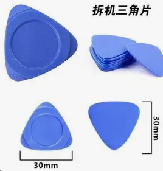
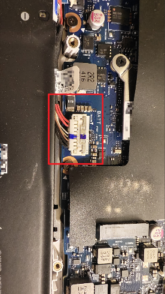

# 前言

笔者对于计算机硬件故障研究不深，只会处理一些简单的常见故障。不过为了章节之间能够成体系，这里还是要简单谈一下如何应对硬件故障。硬件故障会影响设备性能和稳定性，可能导致系统崩溃、数据丢失甚至设备损坏。本文结合专业工具与实用技巧，从故障类型、诊断流程、排除方法及实际案例出发，提供通俗易懂的解决方案。

---

# 故障的常见类型与原因

1. **物理故障**
   - **表现**：硬盘读取错误、主板元件烧毁、显示器无信号等。
   - **原因**：机械磨损（如硬盘电机老化）、液体泄漏、物理撞击或长期高负荷运行导致部件老化。
2. **电气故障**
   - **表现**：电源无法启动、设备突然关机、接口供电不足。
   - **原因**：电源供应不稳定（如电压波动）、短路（如主板电容鼓包）或过载（如超频操作）。
3. **连接故障**
   - **表现**：外设无法识别（如 USB 设备失灵）、内存条接触不良、显卡接口松动。
   - **原因**：插槽氧化、数据线老化或安装不规范（如未插紧）。
4. **软件引发的硬件异常**
   - **表现**：驱动程序冲突导致设备无法识别、系统频繁蓝屏。
   - **原因**：错误的 BIOS 设置、恶意软件占用硬件资源或固件版本不兼容。

上述第一类和第二类故障涉及电路等专业知识，并且需要万用表、电烙铁、植锡网等专业工具，处理起来也比较复杂。第三类和第四类故障相对容易处理。

---

# 常见硬件故障排查与解决

下面举几个常见例子，希望能对你有所帮助。

## 典例一：清灰换硅脂

> 提醒：如果该电脑采用液金，不建议拆除散热模组，否则可能会有短路烧毁的风险。

**需要用到的工具：**各种批头的**螺丝刀**、气吹、酒精棉片、**翘片**、撬棒、防静电手套、磁吸板（零件盒亦可）、**毛刷**、镊子，以及**你的细致严谨的大脑**。

**第一步：拆卸后盖**

​	选择合适的批头对准螺丝进行拆卸。拆卸过程中若发现螺丝长短不一，需要**记住位置**，分开摆放。需要注意的是，部分型号的电脑在角落处会有一颗螺丝不能完全拆卸下来（这常见于天选系列的电脑），这是用于顶开缝隙便于翘片进入。还有部分机型有隐藏螺丝，需要自行必应一下拆解教程（这种通常后部需要拆卸一个面板才能看到）。当后壳螺丝全拧松拆卸后，找一个缝隙，用翘片插入，不用很深。然后沿着边缘依次撬动，使卡扣松开。最后将后盖取下，用毛刷刷去灰尘。

**第二步：拔电池，除静电**

​	部分型号的电脑主板内有光感元件，拆开后盖后会自动断电，但是保险起见，还是建议按流程走完。首先用撬棒或者戴防静电手套的手将电池的连接线拔下。

- 如图，若是这样的接线口，可以直接向后拔出即可。

- 如图，若是像这样的接线口，需要先将上方的金属片向后拨，然后抬起电池线（常见于天选系列笔记本）。为避免金属片与后面的元件接触导致短路，也可以拔掉电池端的接口。

然后反复按动电源键，释放残留静电。

**第三步：清灰**

用毛刷配合气吹将散热风扇扇叶上的灰清除。如果发现风道与散热鳍片间隙处也有大量灰尘，可以使用气吹或镊子尝试清除；若无法清除，则需要将风扇拆卸。若该电脑是风扇与热管一体式设计，则需拆下整个散热模组才能深度清洁。如果不需要更换硅脂，将电脑原样装回即可。对于有感光元件的电脑，需要插上电源线才能开机。

**第四步：换硅脂（非必需）**

对于使用液金和相变材料的笔记本电脑通常不需要更换硅脂，因为它们寿命较长。首先将散热模组拆下，需要注意应按照标识的数字顺序拧松螺丝，避免受力不均。

如上图所示，将 CPU 和 GPU 上面的硅脂清理干净，可用撬棒刮除或用酒精棉片擦除。注意不要蹭掉 GPU 周围显存和侧边一排元件上的导热凝胶或导热垫片，它们通常不需要更换。（如果确实需要更换更好的材料，请务必按原厂性状更换：凝胶只能换凝胶，垫片只能换垫片，不可凝胶换垫片或垫片换凝胶。因为散热模组设计接触高度不同，不同材料的接触效果不同。）硅脂建议使用信越 7921 或霍尼韦尔 7950 相变片进行更换。导热材料只需要薄薄一层覆盖 CPU 和 GPU 的光洁反光面即可，过厚反而影响导热效果。更换完成后，按数字标识顺序拧回螺丝即可。

**第五步：装回去**

怎么拆的就怎么装回去。对于有光感元件的电脑，需要插上电源线才能开机。再次提醒，若后盖螺丝长短不一，需要按原来的位置拧回去，拧紧即可，不需要用很大的力气，否则可能会将另一面顶起小鼓包。

  

## 典例二：BIOS 设置错误

这常常是因为错误进入 BIOS 更改了设置，还忘了改了哪些。这时可以在界面中寻找是否有“恢复默认”或“default”字样，选中后按 Enter 或对应快捷键即可。如下图，最下方提示按 F5。最后按 F10 保存并退出，等待电脑自动重启完成。

  
  
## 典例三：加装硬盘
  
首先确认笔记本电脑是否有空余硬盘位，有空位再进行加装。较新的电脑多采用 2280 规格的 M.2 固态硬盘，因此需要购买对应规格的硬盘（这里推荐致态 Tiplus7100）。将电脑按典例一的方法拆除后盖后，拧掉硬盘位的固定螺丝，对准接口，以 30°~45° 角斜插入新硬盘，然后按住硬盘拧上固定螺丝。
  
现在大部分硬盘厂商不会提前分区，还需要我们在系统中手动进行分区。具体流程在后续章节中详细讲解。
  
## 典例四：处理网卡叠叠乐
  
网卡叠叠乐指网卡在硬盘下方，二者重叠放置。这种设计的优点是节约笔记本内部空间，缺点是硬盘发热会影响网卡正常工作，常见于使用螃蟹网卡的天选锐龙笔记本。如果主要使用 WiFi 而非有线网络，建议将网卡更换为 Intel 网卡以保证稳定（或有多余硬盘位时，将硬盘移至另一个硬盘位）。更换方式与加装硬盘类似，不过需要注意网卡上还接有两根天线，要区分位置，拆卸时小心不要扯断。
  
## 典例五：螺丝拧花了
  
部分品牌电脑的螺丝上得很紧，极其容易拧花。尽管这种问题难以彻底避免，但有办法尽可能降低发生概率，至少注意下面两点：
  
  - 使用合适的螺丝刀批头，尽量严丝合缝，避免使用小号的批头
  - 拧动时保持一定的下压力，缓慢尝试拧动，若螺丝很紧，感觉要拧花时就停下
  
如果螺丝上得很紧，即将拧花或者已经拧花，就要换种方式。笔者比较常用的方法是垫一个橡皮筋，然后保持较大的下压力缓慢拧动。
  
这个办法能应对大部分情况，如果还是不行，那只能使用一些带破坏性的工具，比如用手工小锯子锯出一字型，再用一字螺丝刀拧开。这种办法有一定风险，可能损坏热管；金属碎屑若未及时清理，还会导致主板元件短路，务必谨慎尝试。

---

# 结语

硬件故障的诊断与排除需要系统性思维与实践经验的结合。本文只提及常见情况与解决方法，其他情况读者可自行查阅相关资料。
