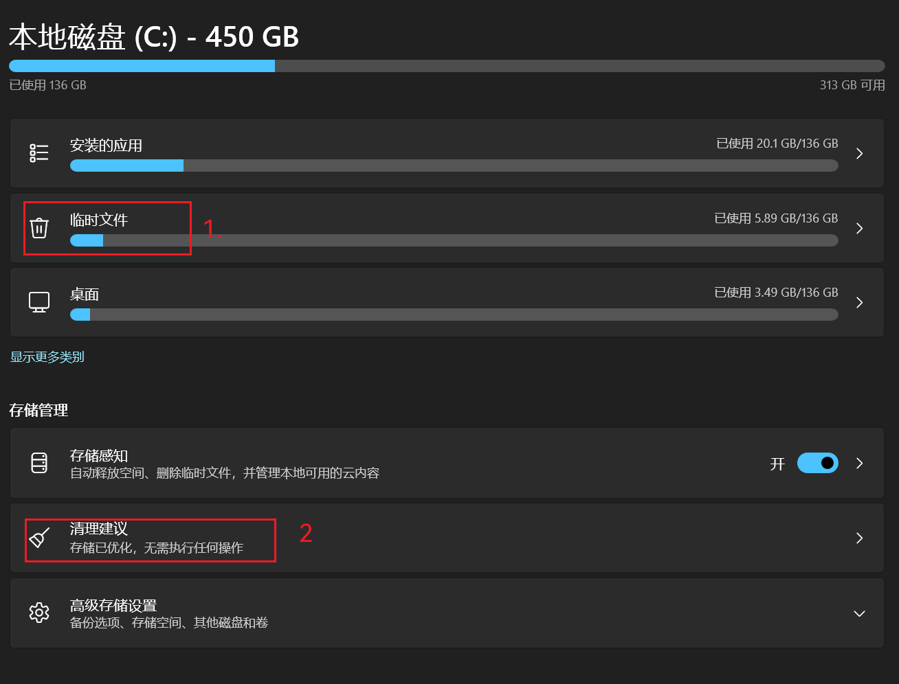
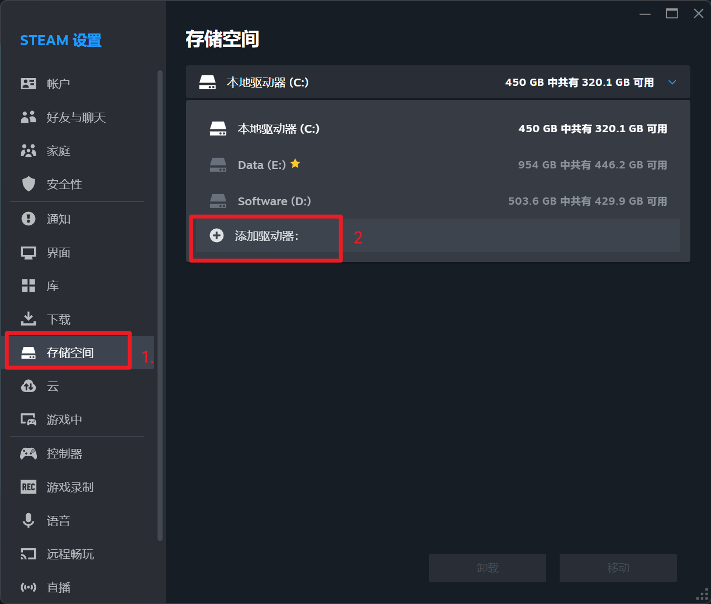
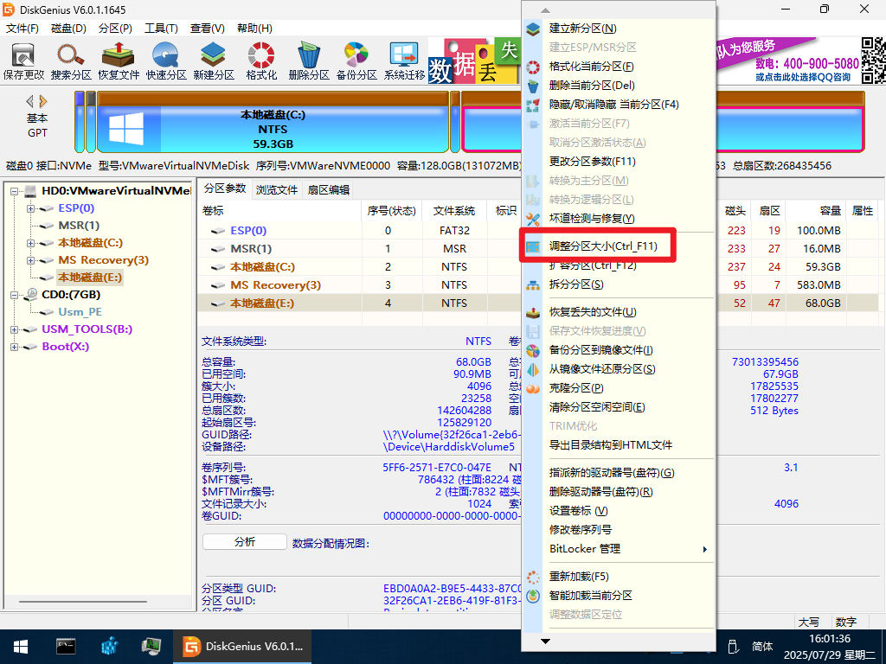
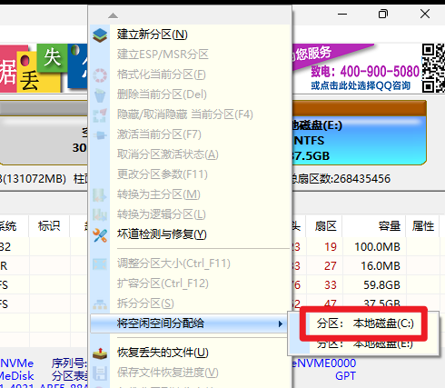
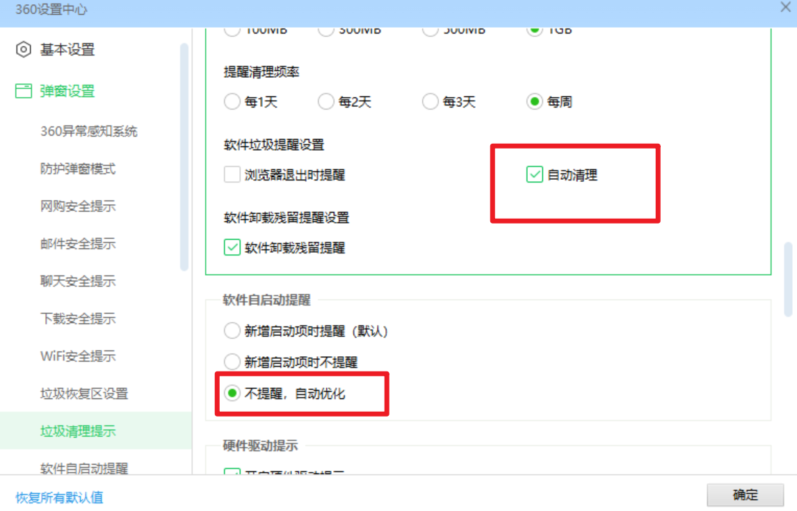
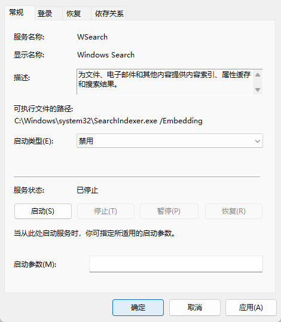

# 前言

在日常使用计算机的过程中，我们经常会遇到C盘空间爆满、系统运行缓慢等问题。这些问题不仅影响了我们的工作效率，也降低了使用电脑的舒适度。造成C盘爆满的原因有很多，可能是由于系统垃圾文件的积累、不合理的软件安装位置或者是聊天软件的消息存储目录设置不当等原因。针对这些问题，我们需要采取一系列措施来优化我们的系统，提升其性能。

本章将从处理C盘爆满的问题出发，介绍如何通过清理垃圾文件、调整软件设置等方法释放C盘空间。接着，我们会讨论如何关闭不必要的启动项和服务以加快系统启动速度和提高系统稳定性。此外，我们还会分享一些对常用软件进行简单设置的方法，以减少弹窗干扰，提升用户体验。最后，我们将探讨关于电脑是否应该长期不关机的话题，并给出合理的建议。

# ⭐一、处理C盘爆满

 C盘爆满往往由多个因素造成，只能根据经验进行一步步地排查。下面对不同原因造成的C盘爆满的排查做了排序，根据编号顺序挨个排查并处理即可。

## 1.常规垃圾文件清理

### （1）利用安全软件自带清理工具进行清理

这里以**360极速版**为例

然后在扫描结果界面根据需要进行勾选要清理的垃圾，如果实在不能判断就默认即可。

### （2）利用Windows自带的功能进行清理

以Windows 11为例，在设置中依次点击“系统”->“存储”来到如下界面

在这个界面中还可以安全地清理一些系统垃圾文件

### （3）清理下载目录

打开下载目录，清理长期不用的文件，并把里面的文件进行转移

### （4）卸载不用的软件，或者重新安装软件到其他盘中

## 2.处理聊天软件消息存储目录

这里给出**微信**和**QQ**各自的设置方式：

### （1）微信

参照图片依次点击：

然后将数据存储位置更改到其他硬盘中。

### （2）QQ

参照图片依次点击：

然后将数据存储位置更改到其他硬盘中。

## 3.更改游戏下载目录

这里以steam为例，参照图片依次点击：

添加其他分区的仓库用于存储游戏资源

再在原来存储游戏的盘中把游戏迁移到新加的游戏仓库

## 4.扩展C盘空间

使用磁盘管理工具压缩其他分区（如D盘）为C盘腾出空间，当然前提是D盘与C盘在同一块物理硬盘中，这通常建议在PE系统中进行操作。这里以DiskGenius工具为例，默认环境为PE系统中：

### （1）缩小D盘空间

在DiskGenius中右键其他盘（即有大量空余空间的盘）调整分区大小

将分区前部空间空余出来，便于与前面的C盘合并

### （2）扩展C盘空间

右键**空余出来的硬盘空间**，然后将该空间分配给C盘，如图所示：

注：若C盘和D盘中间还有一个小WinRE分区，不用管，不影响

最终是下面这样式儿的就对了：

## 5.评估硬盘大小

如果上述方仍然无法很好的解决C盘爆满的问题，就要考虑是否是用户本身对于存储空间需求比较大，是否需要更换更大容量的硬盘了。

# 二、关闭多余启动项与服务项

Windows系统为了兼容性和一些功能的完善会有默认启动很多系统服务项，但其中有很多服务项是我们并不需要使用的，关闭后也不会对日常使用造成任何影响。反而软件启动项和系统服务项过多容易导致开机缓慢，以及开机后电脑卡顿的情况。这里笔者提供一种比较简单易上手的处理方法：

打开电脑上自己安装的安全软件,这里以**360极速版**为例，找到启动项管理的工具

我们可以看到，这里分为**软件启动项**和**系统启动项**，

读者可以根据自己的需要在软件启动项中自行设置，这里给出系统启动项中建议关闭的项目：

然后另外的根据该工具的推荐关闭提示关闭就行。

# 三、对一些软件进行简单设置

我们有很多日常使用的软件在没有设置的默认状态下会有很多的弹窗和臃肿的一些功能，有些会影响使用体验，有些还会影响电脑性能，因此需要对软件进行设置以提升用机效率。

PS：对于日常软件的推荐已经在前面的章节中给出了，默认读者使用的都不是垃圾恶意软件。另外，对于微信和QQ的设置也在上文中给出了。

这里将以WPS、搜狗输入法、360极速版为例，提供一些比较建议更改的设置，当然也可以根据个人需要保留设置。

## 1.设置WPS

在“**开始**”菜单中找到WPS的**配置工具**

点击“高级”

然后在“**功能定制**”选项卡中按下图设置

另外还需要设置一下**WPS云盘**，没有VIP的用户建议将它关闭，有VIP的用户可以继续使用。

在任务栏处找到**WPS云盘**的图标，然后点击“**同步与设置**”

然后按下图所示关闭选项

## 2.设置搜狗输入法

超赞的是官方提供了关闭无用功能的[教程](https://docs.qq.com/doc/DTEtkUHl4am9PbnFX?needShowTips=1)（在4.2和4.3节），这里呢再对官方教程进行一下补充。

单击那个大大的**“S”**，然后点击“**更多设置**”

然后在“**属性设置**”下的“**高级**”选项卡中按下图所示统统关闭

然后在去AI汪仔中把能关的统统关掉

## 3.设置360极速版

打开360极速版的设置界面

然后按下图所示统统关闭

# 四、电脑长期不关机

对于这个问题网上众说纷纭，这里批评某短视频平台上的一些所谓的技术分享博主，只会盲目无脑跟风，并没有把问题说明白也没有什么专业的分析或者严谨的试验，相当地不负责任。

这里笔者先给出结论：**电脑长期不关机容易导致电脑卡顿和系统异常的概率增加，建议至少每2-3天关机或重启一次，能每天用完就关机也不错。**

然后笔者这里简单进行论证一下：

首先，Intel官方给出的答复是“**影响还是会有的，因为长时间睡眠状态不关机，内存不会断电重置，可能会造成内存冗余过多，导致运行速度变慢，建议在保证电量充足的情况下，每2-3天关机或重启一次。**”这里可能就会有小伙伴好奇为什么服务器可以7*24小时不间断运行，那是因为服务器用的都是[Linux操作系统](https://baike.baidu.com/item/Linux/27050)，安装的是[ECC内存](https://baike.baidu.com/item/ECC内存/1691343)，它们的稳定性是普通民用电脑无法比拟的。

然后，笔者在日常的一些维修案例中总结发现，有些抱怨电脑卡顿的用户是没有关机习惯的，在电脑重启后恢复正常。

再者，笔者本人也做了一下试验。笔者手里的笔记本电脑使用的是i9-14900HX+4060显卡+32GB内存和Windows 11 24h2系统，硬件软件配置算是比较新的了。在7天未关机后出现了明显卡顿增加，任务栏显示错误的情况，在重启后恢复正常。

另外，笔者之前使用的电脑是一台老Dell，硬件都是相对比较落后的，系统使用的是Ubuntu 24.04 LTS。最多尝试过17天没有关机，没有明显卡顿增加，也暂时没有发现任何新增bug（Ubuntu自带的小bug还是有一些的）。

总结一下， Windows本身的屎山代码再加上长期不关机的习惯会导致系统的卡顿概率增加，但Windows提供的睡眠和休眠功能并不是一无是处，可以在一两个小时不使用电脑的时候使用，既能节约用电也能保护隐私。建议至少每2-3天关机或重启一次，能每天用完就关机也不错。

# 五、关闭Windows索引

Windows系统的文件搜索功能非常的糟糕，搜索效率低而且资源占用还大。对于一些老旧的硬盘非常不友好，甚至存在老旧硬盘直接报废的可能性。因为这些缺点Windows文件搜索被现在的第三方搜索工具直接碾压，这里点名表扬[Everything](https://www.voidtools.com/zh-cn/support/everything/)，功能强大，性能优秀，资源占用少，是Windows文件搜索的绝佳替代。下面是如何关闭Windows索引的教程，跟着操作完成后安装Everything即可拥有更加丝滑的使用体验。

## 第一步：通过“索引选项”重建和删除索引

1. **打开索引选项** 在任务栏的搜索框中输入“索引选项”，然后点击打开“索引选项（控制面板）”。

    

2. **进入高级设置** 在弹出的窗口中，点击右下角的“高级”按钮，进入“高级选项”窗口。

    

3. **删除和重建索引** 在高级选项窗口中，点击“重建”按钮以删除现有索引。完成后，点击“确定”关闭窗口。

## 第二步：禁用Windows Search服务

1. **打开服务管理器** 按下 Win + R 键，输入 services.msc，然后按回车键。

2. **找到Windows Search服务** 在右侧列表中找到“Windows Search”服务。

    

3. **停止并禁用服务** 双击“Windows Search”，在弹出的属性窗口中： 点击“停止”按钮以停止该服务。 将“启动类型”设置为“禁用”，然后点击“确定”。

    

# 六、卸载迈克菲

迈克菲这款软件会被预装在很多厂商的电脑中，它的防护能力只能说算合格的，但使用体验和资源占用方面很糟糕，非常建议新机到手后都直接卸载掉换别家的。

幸运的是迈克菲官网已经提供了非常详实的教程。先下载这个[MCPR 工具](https://download.mcafee.com/molbin/iss-loc/SupportTools/MCPR/MCPR.exe)然后跟着这个[从 Windows PC 卸载 McAfee 产品 | McAfee 支持](https://www.mcafee.com/support/s/article/000001616?language=zh_CN)操作卸载迈克菲即可。

# 七、修改浏览器搜索引擎（以edge为例）

这里仅推荐读者使用必应（Bing）搜索，它是众多搜索引擎中体验最好的（截至2025年9月16日）。

在浏览器设置页面中根据下图中的路径找到如下界面

在1处改为Bing搜索，在2处可以添加自己喜欢的搜索引擎。

或者在各大安全软件的浏览器防护相关页面进行设置

# 结语

 希望本章提供的内容能够帮助大家更好地理解和解决日常遇到的系统优化与性能调校问题，使您的电脑始终保持高效、流畅的运行状态。