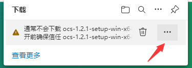
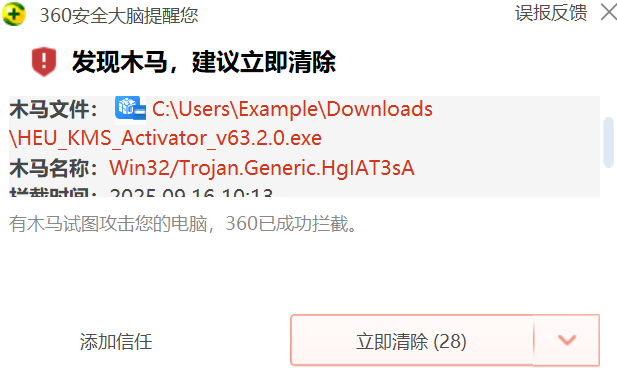
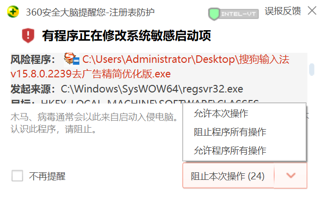

# 前言

在安装软件和使用软件过程中，偶尔会遇到一些警告弹窗，从而导致应用无法正常使用。排除掉软件开发者本身的问题外，其实也是有一些修复办法的。

本章从技术原理、检测方法到解决方案多维度解析 Windows 系统软件冲突与兼容性问题，旨在为用户提供一套系统化的应对策略，帮助用户在享受新系统功能的同时，规避潜在的技术障碍。

---

# 排查问题

软件报出的警告弹窗是非常重要的，一定要仔细阅读内容，切勿懒得看就直接关掉。如果看不懂或者不理解，那就去网上搜索一下警告的内容。

笔者这里将常见软件报错问题分为以下几类：

| 类别 | 常见表现 |
| --- | --- |
| **系统资源与配置类** | 提示内存不足、硬盘空间不够 |
| **组件类** | 提示缺少 .NET Framework、Visual C++ 库、某 DLL（动态链接库）文件等 |
| **权限与安全干扰类** | 安全软件的警告提示，或者系统 UAC 提示 |
| **恶意软件/流氓弹窗类** | 恶意软件的假警告弹窗，点击后通常会跳转到某些广告网站 |
| **版本兼容类** | 试图在较新系统中运行老旧软件，双击打开后闪退或者无反应 |
| **其它类** | 上述未能归类的问题，通常是软件独有的弹窗 |

> **提示**：对于"其它类"问题，建议必应搜索，或者去软件官网或者社区查一下是否有对此类弹窗的说明。

> **名词解释**：
> - **DLL（Dynamic Link Library）**：动态链接库，是 Windows 系统中一种可执行文件格式，包含可被多个程序同时使用的代码和数据。许多软件依赖特定的 DLL 文件才能正常运行。
> - **UAC（User Account Control）**：用户账户控制，是 Windows 系统的一项安全功能，用于防止未经授权的更改。当程序尝试进行需要管理员权限的操作时，系统会弹出 UAC 提示框请求用户确认。

---

# 注意

一切警告弹窗请**务必仔细阅读**，不得糊弄随便点击。如果你不能理解警告的内容，请务必搜索查阅或向专业人员寻求帮助。

---

# 处理典型故障

## 典例一：内存不足

此问题常见于运行剪辑软件或其它大型软件时，当然一些经验不足的开发者也可能制造内存溢出的 bug。

**应对措施：**
- 尽量关闭后台运行的软件
- 更换软件版本
- 增加内存条
- 设置虚拟内存

**虚拟内存设置教程：**
- [Win11 设置虚拟内存](https://www.sysgeek.cn/windows-11-virtual-memory-manage/)
- [Win10 电脑虚拟内存设置](https://zhuanlan.zhihu.com/p/694763788)
- [Win7 下如何设置虚拟内存](https://jingyan.baidu.com/article/0bc808fc6e3ac71bd485b9fa.html)

> **名词解释**：
> - **虚拟内存**：当物理内存（RAM）不足时，系统会将硬盘的一部分空间作为临时内存使用。虽然速度比物理内存慢很多，但可以防止因内存不足而导致的程序崩溃。

---

## 典例二：存储空间不足

此问题常见于文件资源管理器中显示硬盘已经红了仍要往里塞东西的情况。

**解决方案：**
- 清理硬盘垃圾文件（相关内容在**系统优化与性能调校**章节有提及）
- 更换至仍有大量空间的硬盘（如果有的话）

---

## 典例三：缺少某个组件

缺啥补啥就可以了。这里推荐三个大佬打包好的 Windows 常用运行库，对于提示缺少 .NET Framework、Visual C++ 库之类的情况能够很好地解决。

**推荐运行库合集：**
- [微软常用运行库合集 2025(06.18) 六月版 - 果核剥壳](https://www.ghxi.com/yxkhj.html)
- [VisualCppRedist(运行库合集) v92 - 果核剥壳](https://www.ghxi.com/visualcppredist.html)
- [游戏运行库、游戏常用运行库 合集 | Game Runtime Libraries Package | GRLPackage](https://www.mefcl.com/grlpackage.html)

**针对缺少 DLL 文件的情况：**

推荐一个免费好用的工具：[DLL 修复工具免费版](https://gitcode.com/open-source-toolkit/be069/blob/main/DirectX_V4.3.0.40864_XiTongZhiJia.zip)

如果上述工具仍无法修复，建议去必应搜索缺少的文件名，找个看起来靠谱的网站下载该 DLL 文件，再把文件放到对应的位置（提供下载这个文件的网站应该会有说明）。

> **名词解释**：
> - **.NET Framework**：微软开发的软件框架，许多 Windows 应用程序依赖它才能运行。不同版本的应用程序可能需要不同版本的 .NET Framework。
> - **Visual C++ 库**：微软 Visual C++ 编译器生成的运行库，许多用 C++ 编写的程序需要特定版本的 Visual C++ 库才能正常运行。

---

## 典例四：安全软件提示以及 UAC 提示

通常软件在安装过程中如果有增改某些敏感文件时，安全软件就会有警告提示。

**判断标准：**
- 若该软件是正规官方网站上下载的，允许即可，或者选择暂时关闭安全软件
- 若从邮件或者某小网站上下载的软件，安全软件提示时，需要仔细阅读是否是该软件应该做出的操作
  - 例如：一个更换壁纸的软件却需要修改 EFI 文件或者有其它捆绑软件，那就很可能是恶意软件了

### UAC 提示处理

UAC 提示通常长这样：

点击"是"就行了。如果觉得该提示很烦人，可以点击"选择何时显示更改通知"，按下图调整就可以了：

---

## 典例五：恶意软件广告弹窗

删除就完事儿了。

### 处理步骤

**1. 避免交互**

- 不点击弹窗中的任何按钮（尤其是"关闭"或"确认"），防止触发恶意下载或数据泄露
- 使用任务管理器（`Ctrl+Shift+Esc`）强制结束相关进程
  - 定位弹窗对应的进程，右键选择"打开文件所在位置"
  - 若发现可疑文件，可直接删除

**2. 使用安全软件自带的软件管家进行删除**

---

## 典例六：版本兼容性问题

右键软件的快捷方式，然后切换到"兼容性"选项卡，根据需要进行设置即可：

需要说明的是，一些软件可能对管理员权限有需求。为了省去每次右键以管理员身份运行，可以在这里勾选上"以管理员身份运行此程序"。

---

## ★ 典例七：中文路径问题

一些国外的软件和游戏并不支持安装在中文路径，并且它们用来存一些必要数据的 `C:\Users\［你的用户名］\AppData` 目录不能是中文的，也就是说你的用户名也不能是中文的，否则会报错无法运行。

对于此类问题，先看看能否更改安装目录。如果更改安装目录仍报错，可能就要考虑换成英文用户名了。

> **注意**：用户数据的路径与很多系统组件都是绑定的，只更改文件夹中的中文用户名是不行的，需要进行一些比较麻烦的操作。但是如果你在 OOBE 阶段就填写的英文用户名，就不用担心这样的问题了。

下面提供其中一种更换英文用户的方法，该方法比较稳定和简单（这里以 Win11 为例，Win10 同理）：

### 1. 创建一个英文名用户

**（1）在设置中打开这个界面，点击"添加账户"：**

**（2）按下面图片所示，依次点击：**

**（3）填写英文名：**

**（4）另外还需要点击"更改账户类型"，将新创建的账户改为管理员账户。**

### 2. 注销，然后登录进新创建的账号

你会发现安装在 `Program Files` 目录中的应用在此账号中依然可以使用，但是安装在旧账号的 `AppData` 中的软件无法在新账号中使用。此时需要你对这些软件进行重新安装。

### 3. 转移文件

在新账户中来到旧用户的文件夹，如图所示：

将红框中的文件夹复制到新账户的对应文件夹中，你的桌面图标以及微信和 QQ 聊天记录也都回来了。

### 4. 登录账号

一些软件的账号需要重新登录一下。

### 5. 删除原账户

来到刚创建账户的设置页面，可以看到旧账户，点击右侧删除即可：

---

### * 这里再提供一个直接更改原用户名的方法

[如何将 Windows 中文用户名改成英文？超详细教程，一次解决软件报错问题！ - 知乎](https://zhuanlan.zhihu.com/p/1920912262664819865)

---

## 典例八：因文件存在风险导致的弹窗

请确保你要下载或者运行的文件是安全的。若确认是安全的文件，请根据下面来操作：

### 在 Edge 浏览器中下载警告提示

点击，选择"保留"：

或者直接点击"保留"：

### 运行风险软件的 Defender 警告提示

点击"更多信息"，然后选择"仍要运行"即可。

> **名词解释**：
> - **SmartScreen**：Windows Defender 的安全筛选功能，用于帮助识别和阻止网络钓鱼网站和恶意软件下载。

### 安全软件对风险软件的提示（以 360 为例）

**1）运行风险软件提示**

如果确定要运行的程序没有问题，点击"添加信任"，然后再次运行该程序即可。

**2）软件风险操作提示**

点击右侧"允许本次操作"或者"允许程序所有操作"即可。

---

# 结语

Windows 系统的软件兼容性问题，归根结底是技术不断演进与历史遗留需求之间的一场博弈。随着操作系统版本的更迭，新功能的引入和旧机制的淘汰不可避免地带来一系列兼容性挑战。

用户在享受系统升级带来的性能提升与功能优化的同时，也常常面临软件无法正常运行、警告弹窗频出等问题。希望本章内容能够帮助读者建立起一套完整的软件冲突排查与兼容性问题处理的思维体系，在面对 Windows 系统中的各种软件异常时，游刃有余、从容应对。
