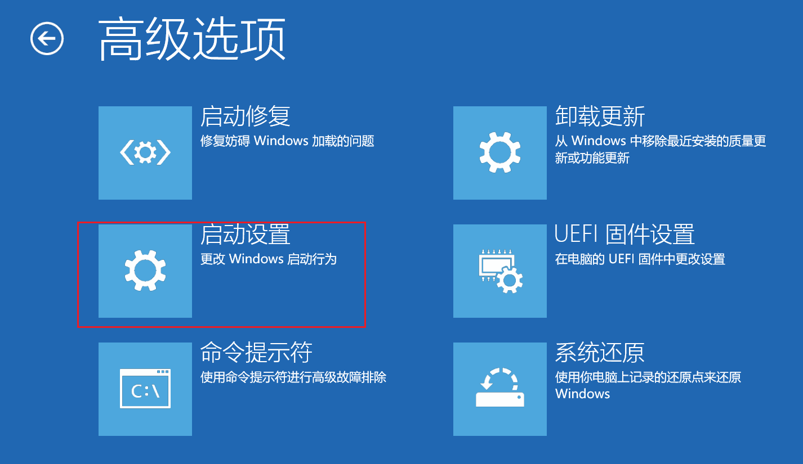
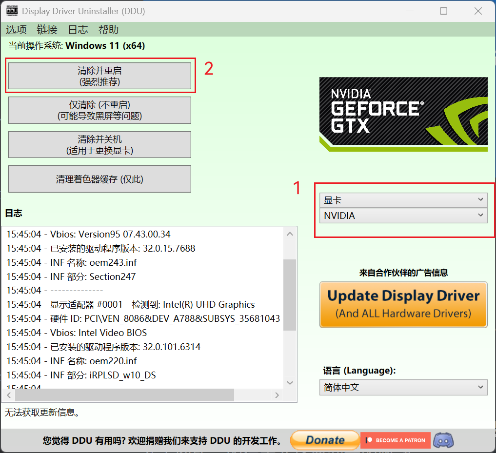

# 前言

在使用计算机的过程中，我们难免会遇到一些硬件驱动、系统设置或 BIOS 更新等相关问题。尤其是在重装系统后，常常会遇到显示缩放比例异常、亮度无法调整、网络连接失败等令人头疼的问题。这些问题的背后，往往是因为缺少关键的驱动程序或者系统设置未调整到位。尽管 Windows 10 及后续系统版本自带了大量通用驱动，但它们并不总是能够完美适配所有硬件。为了帮助大家解决这些问题，本章将围绕驱动安装、BIOS 更新以及显卡驱动损坏等典型问题，提供一套系统的解决方案。

---

# 典型问题处理

## 1. 安装驱动

### 1.1 使用第三方软件安装驱动

在重装完系统后，您可能会惊讶地发现电脑的显示缩放比例不对、无法调整亮度或者无法联网。尽管 Windows 10 及以后系统中自带了很多通用的网卡驱动，但是仍然偶尔会遇到无法联网的情况。这种情况会非常尴尬，陷入了死循环。

因此需要提前准备好包含网卡驱动的驱动软件到 U 盘中。这里推荐 [360 驱动大师网卡版](https://down.360safe.com/drvmgr/gwwk__360DrvMgrInstaller_net.exe) 和 [驱动总裁万能网卡版](https://www.sysceo.com/software-softwarei-id-245.html)，但是需要特别说明的是这两个软件都会有一些广告，注意不要勾选不该勾选的东西。

这两个软件任选其一即可，操作都很简单，根据提示安装完成后重启即可。

> **什么是驱动程序？**
> 驱动程序（Device Driver）是一种特殊的计算机程序，它充当硬件设备与操作系统之间的桥梁。操作系统通过驱动程序来控制和管理硬件设备，使其正常工作。没有正确的驱动程序，硬件设备可能无法被识别或无法发挥全部功能。例如，显卡驱动程序可以让操作系统正确识别和使用显卡的性能，网卡驱动程序则负责让计算机能够连接网络。

### 1.2 使用 Windows 更新自动安装驱动

并不是很建议使用这个方法，主要原因是 Windows 只会安装主要的驱动程序，一些不是那么重要的驱动就不会安装好。

### 1.3 从厂商官网下载驱动

这种方法在能联网的情况下最为妥当，如果不能联网也可以事先在其他电脑上下载到 U 盘中。这里以华硕官网为例：

（1）打开[下载中心 | 官方支持 | ASUS 中国](https://www.asus.com.cn/support/download-center/)，然后填入您电脑的型号（通常会在电脑的底部铭牌上），再在下方选择您的电脑。

然后在右侧点击"驱动程序和工具软件"。

接着您会发现它再次让您选择型号（确实有些许繁琐了@ASUS）。

最后您就可以来到下载驱动的页面了，您会发现它给您分门别类列好了，每类中可以点击"查看更多"来查看更多驱动（这一步建议做）。每类中可能有多个需要安装的驱动，比如显卡驱动就有核显与独显驱动需要安装。每类中只用下载各一个不同的最新版本的驱动即可。下载完后全部安装完然后重启就好了。

> **什么是核显和独显？**
> 核显（集成显卡）是指集成在 CPU 内部的显卡，它使用系统内存作为显存，功耗低但性能相对较弱。独显（独立显卡）是指独立安装在主板上的显卡，拥有独立的显存芯片，性能强劲但功耗较高。很多笔记本电脑同时配备了核显和独显，系统会根据任务需求自动切换使用，以平衡性能和功耗。

---

## 2. 更新 BIOS

BIOS（Basic Input/Output System，基本输入/输出系统）是一组固化到计算机内主板上一个 ROM 芯片上的程序，它保存着计算机最重要的基本输入输出的程序、开机后自检程序和系统自启动程序。此外，BIOS 还向操作系统提供一些系统参数。因此，更新 BIOS 往往用于修复比较底层的问题。比如前段时间爆出来的 Intel CPU 缩缸问题，厂商发布新的 BIOS 修正性能参数解决了问题。

BIOS 通常不需要更新，厂商也不会经常更新 BIOS，但是一旦厂商更新了 BIOS 往往就是需要修复一些比较重要的底层问题了。简单来说就是其他更新可以有选择地进行更新，但是 BIOS 最好能更新就更新。

通常 Windows 更新组件会自动更新驱动，其中就会携带 BIOS 的更新包。另外，厂商预装在系统中的软件会提供更新驱动的功能，也可以更新 BIOS。当然，如果您有编程器可以把 BIOS 刷进去那也很棒了。

在更新 BIOS 过程中不同品牌的电脑展现出来的状态也不一样，有些会重启几次，有些会卡在 logo 处一会儿，还有些会风扇狂转然后嘟嘟叫几声（真的）。此时千万不要试图强制关机或者切断电源，并不是电脑更新坏了∑(￣□￣;)，这是正常的，等待一会儿就会完成开机来到登录界面。

> **什么是 BIOS？**
> BIOS（Basic Input/Output System，基本输入/输出系统）是计算机启动时首先运行的程序，它存储在主板上的闪存芯片中。BIOS 负责在计算机启动时进行硬件自检（POST），检测内存、CPU、硬盘等硬件设备是否正常，然后加载操作系统。BIOS 还提供了一些基本的硬件配置功能，如设置启动顺序、调整 CPU 频率等。现代计算机中，BIOS 正逐渐被 UEFI（统一可扩展固件接口）所取代，但功能类似。
>
> **什么是 ROM 芯片？**
> ROM（Read-Only Memory，只读存储器）是一种只能读取不能随意写入的存储器。在 BIOS 的上下文中，ROM 芯片通常指主板上的闪存芯片，用于存储 BIOS 程序。虽然它被称为 ROM，但实际上大多是可擦写的，这样用户才能更新 BIOS。

---

## 3. 显卡驱动损坏

显卡驱动损坏往往出现在更新显卡驱动过程中强制关机或者删除了一些重要文件之后。一般的显卡驱动出问题只需要卸载驱动重新安装或者执行清洁安装即可，在一些严重的情况下可能会出现闪屏、卡死等情况。因此，此处笔者提供一种比较通用且彻底的解决办法，能够很好地解决后者的情况。

### 3.1 进入 Windows 安全模式

这里有两种比较简单的进入方法：

#### （1）方法一

进入系统后点击重启按钮，按住 Shift 键不放，进入如下界面，根据图示依次选择。

然后在下图界面中按数字 4。

然后就成功进入了 Windows 的安全模式。

> **什么是 Windows 安全模式？**
> Windows 安全模式是一种特殊的启动模式，它只加载最基本的系统驱动和服务，不加载第三方软件和驱动。这种模式主要用于排查和修复系统问题，因为在这种模式下，很多可能导致系统异常的第三方程序都不会运行。例如，当显卡驱动损坏导致系统无法正常显示时，可以进入安全模式卸载损坏的驱动，然后重新安装正确的驱动。

#### （2）方法二

在电脑开机过程中反复长按电源键强制关机，多试几次就可以进入到方法一中的界面。

### 3.2 卸载并安装驱动

这时拿出提前准备好的[英伟达驱动](https://www.nvidia.cn/geforce/drivers/)和[DDU 显卡驱动程序卸载工具](https://www.ghxi.com/ddu.html)。打开 DDU 后会有一些提示弹窗，默认即可。然后在下图所示的位置选择要卸载的驱动，然后点击"清除并重启"。

重启完成后安装驱动即可。

> **什么是 DDU？**
> DDU（Display Driver Uninstaller，显卡驱动卸载工具）是一款专业的显卡驱动程序卸载软件。与普通的卸载程序不同，DDU 会彻底清除显卡驱动的所有相关文件、注册表项和配置文件，确保系统中没有任何残留的驱动文件。这对于解决显卡驱动损坏导致的各种问题非常有效，可以避免因旧驱动残留而引发的新驱动安装问题。

---

# 一些不能做的操作

1. 严禁使用lu大师、驱动jingling甚至一些小作坊安装驱动的工具，绝对不可以！绝对！(・`ω´・)

2. 严禁在安装驱动的过程中关机或重启电脑或其他强制终止的行为，若确要终止请点击"取消"。

3. 严禁在更新 BIOS 的过程中关机或重启电脑或其他强制终止的行为，绝对不可以！绝对！(・`ω´・)

4. 由读者来补充(●´ω｀●)ゞ。

---

# 结语

通过本文的介绍，相信大家已经对如何处理常见的驱动问题、BIOS 更新以及显卡驱动损坏的情况有了清晰的认识。技术问题虽然复杂，但只要掌握正确的处理方法，就能迎刃而解。在面对系统重装或驱动异常时，不再手足无措，而是能够从容应对，快速恢复电脑的正常运行。
