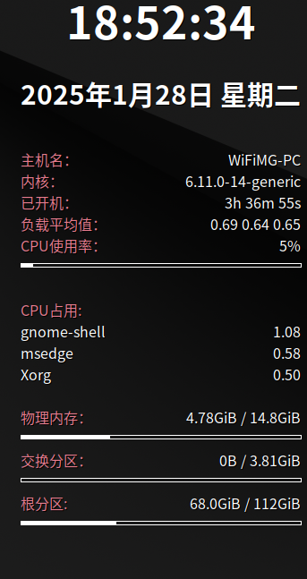
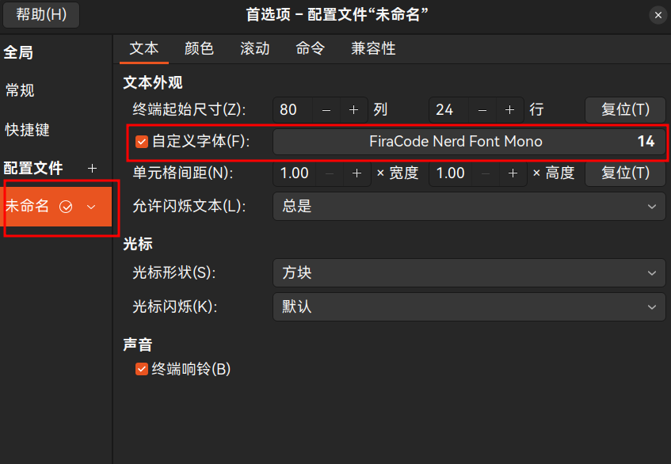
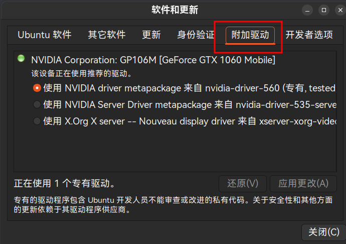
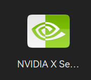
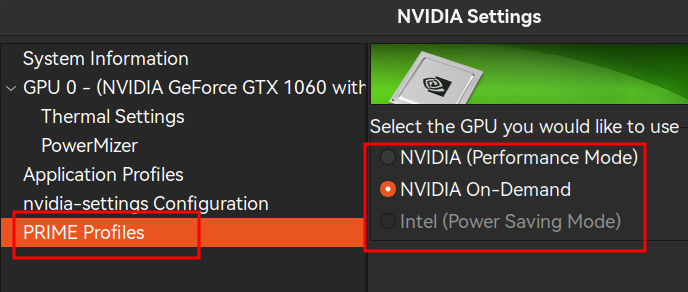
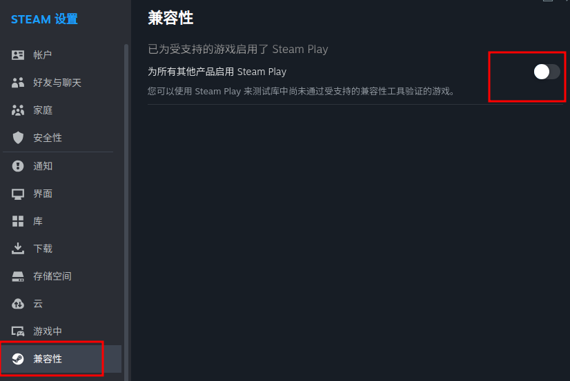
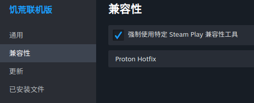

# 前言

本教程因考虑到驱动兼容性、操作易用性、软件生态等诸多因素，将以Ubuntu24.10为例，亲测亦可应用于Ubuntu24.04LTS上，其它Linux发行版的gnome桌面环境大同小异，大部分情况只需要将apt替换成相应的包管理器（如dnf、zypper、pacman）即可。本教程将涵盖基本使用环境的配置，基本美化配置，游戏配置。默认读者已经完成了安装系统。

# 基本配置

## 软件源

如果你在安装时选择了中文以及中国上海时间，那么Ubuntu默认会选择中国软件源。如果你不放心可以打开“软件和更新”检查一下。其它Linux发行版需要自行必应一下换源方法。

打开终端然后执行以下代码，并输入密码

```bash
sudo apt update && sudo apt upgrade -y && sudo apt autoremove -y && sudo apt autoclean -y && sudo snap refresh
```

完成后重启系统。

## 一些工具

打开终端然后执行以下代码，并输入密码

```bash
sudo apt install  -y ubuntu-restricted-addons ubuntu-restricted-extras  gnome-tweaks gnome-shell-extensions vim git wget curl gdebi synaptic
```


## 输入法

这里我强烈推荐大家使用rime输入法，虽然它配置起来特别麻烦，但是幸好有其他大神编辑好的配置文件，直接git下来简单修改一下就好了。

### 安装本体

打开终端然后执行以下代码，并输入密码

```bash
sudo apt install fcitx5 fcitx5-rime fcitx5-gtk fcitx5-qt fcitx5-im fcitx5-configtool vim
```

如果系统预装好了fcitx4那么会提醒选择卸载，根据提示卸载即可。

### 基本配置

先配置一下~/.xprofile避免打字太快出现漏字的情况，打开终端输入

```bash
vim  ~/.xprofile
```

然后按i进入编辑模式，粘贴如下内容

```bash
export GTK_IM_MODULE=fcitx 

export QT_IM_MODULE=fcitx 

export XMODIFIERS="@im=fcitx"
```

按Esc键退出编辑模式，然后在英文状态下输入“:wq”（注意是双引号内的全部内容，含冒号）

### 核心配置

这里推荐使用雾凇拼音+万象语言模型来实现绝佳的输入体验

打开终端，依次输入以下命令：

```bash
git clone  https://bgithub.xyz/iDvel/rime-ice  --depth=1
```

切换进目录：

```bash
cd rime-ice
```

实现逗号、 句号翻页：

```bash
sed -i 's/# \(- { when: \(paging\|has_menu\), accept: \(comma\|period\), send: Page_\(Up\|Down\) }\)/\1/' default.yaml
```

接下来是配置语言模型,通过以下命令来下载万象语言模型

```bash
wget  https://bgithub.xyz/amzxyz/RIME-LMDG/releases/download/LTS/wanxiang-lts-zh-hans.gram
```

然后让其与雾凇拼音协同，输入以下命令

```bash
vim rime_ice.custom.yaml
```

然后按i进入编辑模式，粘贴如下内容

```yaml
patch:
  grammar:
    language: wanxiang-lts-zh-hans
    collocation_max_length: 5
    collocation_min_length: 2
  translator/contextual_suggestions: true
  translator/max_homophones: 7
  translator/max_homographs: 7
```

按Esc键退出编辑模式，然后在英文状态下输入“:wq”（注意是双引号内的全部内容，含冒号）

切换出目录

```bash
cd ..
```

将配置好的文件导入进rime中

```bash
cp -r ./rime-ice/* ~/.local/share/fcitx5/rime
```

如果这条命令执行失败就先执行一次下面这个命令

```bash
mkdir ~/.local/share/fcitx5/rime
```

然后删除掉用于编辑的临时文件夹

```bash
rm -rf rime-ice
```

### 设置开机自启动

还记得开头让安装的gnome-tweaks工具吗？这时候就派上用场了，找到这个软件然后打开它


进入这里设置让Fcitx5开机自启动


**至此，对于输入法的配置 已经完工了，重启系统后即可正常使用。**

## 常用软件与字体

### 安装常用软件

像钉钉、微信、QQ、ToDesk、WPS等这些必备软件已经有了官方Linux版本，可根据需要去官网下载amd64的deb包到“下载”目录。接下来是介绍一些大神开发的好用软件，去release界下载amd64的deb包到“下载”目录

这个是基于electron的哔哩哔哩Linux版https://github.com/msojocs/bilibili-linux/releases/tag/v1.16.2-2

这个是多平台免费听歌软件https://github.com/listen1/listen1_desktop/releases/tag/v2.32.0

这个是多平台免费好用的下载器https://github.com/agalwood/Motrix/releases/tag/v1.8.19

这个是多平台烧写镜像文件工具https://github.com/balena-io/etcher/releases/tag/v1.19.25

这个是开源好用的解压工具（kde用户下载qt版，gnome用户下载gtk版）https://peazip.github.io/peazip-linux.html

然后在“下载”目录，右键在这里打开终端，输入以下命令

```bash
sudo apt-get install ./*.deb
```

这里解释一下不用dpkg安装deb包的原因，dpkg安装就只会安装deb包里的东西，不会管依赖什么的，而用apt工具安装会一起将软件依赖安装上。

### 安装常用字体

安装完微信和WPS后可能会有缺失字体的情况，不过好在这比较好处理

你可以参照其他的教程将Windows的fonts文件夹安装到Linux中，不过这里我提供一个比较便捷的方法，

先去这里将“字体.zip”下载下来并解压，

https://www.123865.com/s/eHLA-SJ6Ph?

或者

https://www.123684.com/s/eHLA-SJ6Ph?

提取码:4agU

然后打开终端输入以下命令，并输入密码

```bash
sudo mv  ./字体/*  /usr/share/fonts/
```

输入以下命令使更改生效

```bash
fc-cache -fv
```

**恭喜，到这里你已经完成了对Linux的基本配置**

# 美化配置

### 桌面扩展插件

因为本文是基于gnome桌面环境进行配置，所以这里需要装一些实用插件

去这个网站上根据需要安装下列插件https://extensions.gnome.org/#


安装完成后你可以去“扩展”这个软件里对插件进行设置，建议将输入法面板的字体大小调整一下，以及Vitals的位置调整一下。

### Ubuntu dock栏

去系统设置里面按如下设置即可，其他设置项根据自己需要来设置


### 桌面显示系统信息

这里需要用到conky这个强大的软件，它很强大，受篇幅限制这里只是基础地配置一下，如果读者感兴趣可以自己探索一下高级用法。

输入以下命令安装conky

```bash
sudo apt install conky-all
```

然后编辑一下配置文件

```bash
vim ~/.conkyrc
```

然后按i进入编辑模式，粘贴如下内容

```bash
default_color white
double_buffer yes
no_buffers yes
update_interval 1.0
total_run_times 0
own_window yes
own_window_type normal
own_window_transparent yes
own_window_hints undecorated,below,sticky,skip_taskbar,skip_pager
own_window_colour 000000
own_window_argb_visual yes
own_window_argb_value 0
double_buffer yes
draw_shades yes
draw_outline no
draw_borders no
draw_graph_borders n0
minimum_size 300 1
maximum_width 406
default_color ffffff
default_shade_color 000000
default_outline_color 000000
alignment top_right
gap_x 6
gap_y 5
cpu_avg_samples 2
override_utf8_locale no
uppercase no
use_spacer no
use_xft yes
xftfont WenQuanYi Zen Hei:pixelsize=15
override_utf8_locale yes
use_spacer no
minimum_size 300 1

TEXT
${font LCD:style=Bold:pixelsize=50}${alignc}${time %H:%M:%S}
${font LCD:style=Bold:pixelsize=30}${time %Y年%b%d日 星期%a}${alignc}
${font WenQuanYi Zen Hei:pixelsize=16}
${color #e77c8e}主机名：${color}$alignr$nodename
${color #e77c8e}内核：${color}$alignr$kernel
${color #e77c8e}已开机：${color}$alignr$uptime
${color #e77c8e}负载平均值：${color}$alignr$loadavg
${color #e77c8e}CPU使用率：${color}$alignr$cpu%
${cpubar 4}

${color #e77c8e}CPU占用:${color}
${top name 1} ${alignr}${top cpu 1}
${top name 2} ${alignr}${top cpu 2}
${top name 3} ${alignr}${top cpu 3}

${color #e77c8e}物理内存：${color}${alignr}$mem / $memmax
${membar 4}
${color #e77c8e}交换分区：${color}${alignr}$swap / $swapmax
${swapbar 4}
${color #e77c8e}根分区: ${color}${alignr}${fs_free /} / ${fs_size /}
${fs_bar 4 /}
```

按Esc键退出编辑模式，然后在英文状态下输入“:wq”（注意是双引号内的全部内容，含冒号）

然后继续去这里设置conky的自启动


重启后你就可以发现你的桌面上显示了这样的界面



### 美化终端

这里会涉及到大量的命令，请做好心里准备

#### 安装zsh

```bash
sudo apt install zsh
touch ~/.zshrc
chsh -s /usr/bin/zsh
```


#### 安装配套字体

```bash
wget https://ghproxy.cn/ryanoasis/nerd-fonts/releases/download/v3.2.1/FiraCode.zip
unzip FiraCode.zip -d ~/.local/share/fonts
rm FiraCode.zip
fc-cache -fv
```


#### 安装p10k

```bash
git clone --depth=1 https://ghproxy.cn/romkatv/powerlevel10k.git ~/powerlevel10k
echo 'source ~/powerlevel10k/powerlevel10k.zsh-theme' >>~/.zshrc
```

然后将终端字体设置为FiraCode字体





接着输入以下命令

zsh

然后根据提示完成个性化配置

#### 安装zsh插件

这里特别说明一下Ubuntu源里面有zsh-autosuggestions和zsh-syntax-highlighting两个插件，直接用apt安装即可，但是考虑到其他Linux发行版的用户（如openSUSE）可能无法通过包管理器安装这两个插件。为了兼容性，这里我采用的还是git源码的方式来安装。

依次执行以下命令：

```bash
sudo git clone https://bgithub.xyz/zsh-users/zsh-autosuggestions.git  /usr/share/zsh-autosuggestions

sudo git clone https://bgithub.xyz/zsh-users/zsh-syntax-highlighting.git  /usr/share/zsh-syntax-highlighting

sudo git clone https://bgithub.xyz/zsh-users/zsh-history-substring-search.git  /usr/share/zsh-history-substring-search

echo 'source /usr/share/zsh-autosuggestions/zsh-autosuggestions.zsh' >> ~/.zshrc

echo 'source /usr/share/zsh-syntax-highlighting/zsh-syntax-highlighting.zsh' >> ~/.zshrc

echo 'source /usr/share/zsh-history-substring-search/zsh-history-substring-search.zsh' >> ~/.zshrc
```

然后使用以下命令使更改生效

```bash
source ~/.zshrc
```


#### 实用配置

```bash
sudo apt install eza

vim ~/.zshrc
```

切换光标到最后一行，按大写A以从行末开始编辑，然后回车换行，粘贴以下内容

```shell
autoload -Uz run-help
(( ${+aliases[run-help]} )) && unalias run-help
alias help=run-help
autoload -Uz run-help-git run-help-ip run-help-openssl run-help-p4 run-help-sudo run-help-svk run-help-svn

autoload -Uz compinit promptinit
compinit
promptinit

HISTFILE=~/.zsh_history
HISTSIZE=1000
SAVEHIST=2000

TIMEFMT=$'\nreal\t%E\nuser\t%U\nsys\t%S\ncpu\t%P'

# Case-insensitive tab completion (match lower and upper case)
zstyle ':completion:*' matcher-list 'm:{[:lower:][:upper:]}={[:upper:][:lower:]}'
zstyle ':completion:*' matcher-list 'm:{a-zA-Z}={A-Za-z}'

# Use colors for completion listings (different colors for directories, files, etc.)
zstyle ':completion:*' list-colors "${(s.:.)LS_COLORS}"

# Enable rehash so new executables in the PATH are automatically found
zstyle ':completion:*' rehash true

# Enable menu selection (highlight options when navigating with tab)
zstyle ':completion:*' menu select

# Automatically accept exact matches in completion, even if partially typed
zstyle ':completion:*' accept-exact '*(N)'

# Enable caching for faster completion, and define the cache path
zstyle ':completion:*' use-cache on
zstyle ':completion:*' cache-path ~/.zsh/cache

# Add auto-description for completion items (shows additional information)
zstyle ':completion:*' auto-description 'specify: %d'

# Specify completion methods: first expand aliases, then complete commands
zstyle ':completion:*' completer _expand _complete

# Format the completion display with a message indicating what is being completed
zstyle ':completion:*' format 'Completing %d'

# Remove group names from completion listings
zstyle ':completion:*' group-name ''

# List prompt for showing how to navigate through completion options
zstyle ':completion:*' list-prompt %SAt %p: Hit TAB for more, or the character to insert%s

# Select prompt for scrolling through completion menu
zstyle ':completion:*' select-prompt %SScrolling active: current selection at %p%s

# Disable the use of older `compctl` completions (use new style completion)
zstyle ':completion:*' use-compctl false

# Enable verbose completion output
zstyle ':completion:*' verbose true

# Custom completion style for `kill` command, listing processes with detailed information
zstyle ':completion:*:kill:*' command 'ps -u $USER -o pid,%cpu,tty,cputime,cmd'

# Set colors for the `kill` command completion (red color for process IDs)
zstyle ':completion:*:*:kill:*:processes' list-colors '=(#b) #([0-9]#)*=0=01;31'

EDITOR=vim
alias c='clear'
alias ls='eza -a --icons'
alias ll='eza -al --icons'
alias lt='eza -a --tree --level=1 --icons'
alias shutdown='systemctl poweroff'
alias v='$EDITOR'
alias vim='$EDITOR'
alias wifi='nmtui'
alias Qtile='startx'
alias gs="git status"
alias ga="git add"
alias gc="git commit -m"
alias gp="git push"
alias gpl="git pull"
alias gst="git stash"
alias gsp="git stash; git pull"
alias gcheck="git checkout"
alias gcredential="git config credential.helper store"
alias update-grub='sudo grub-mkconfig -o /boot/grub/grub.cfg'
alias res1='xrandr --output DisplayPort-0 --mode 2560x1440 --rate 165'
alias res2='xrandr --output DisplayPort-0 --mode 1920x1080 --rate 165'
alias setkb='setxkbmap de;echo "Keyboard set back to de."'
alias cp="cp -i"                                                # Confirm before overwriting something
alias df='df -h'                                                # Human-readable sizes
alias free='free -m'                                            # Show sizes in MB
alias gitu='git add . && git commit && git push'
alias history="history 0"
alias grep='grep --color=auto'
alias fgrep='fgrep --color=auto'
alias egrep='egrep --color=auto'
alias diff='diff --color=auto'
alias rm='rm -i'
alias ip='ip --color=auto'
alias la='ls -A'

setopt correct                                                  # Auto correct mistakes
setopt extendedglob                                             # Extended globbing. Allows using regular expressions with *
setopt nocaseglob                                               # Case insensitive globbing
setopt rcexpandparam                                            # Array expension with parameters
setopt nocheckjobs                                              # Don't warn about running processes when exiting
setopt numericglobsort                                          # Sort filenames numerically when it makes sense
setopt nobeep                                                   # No beep
setopt appendhistory                                            # Immediately append history instead of overwriting
setopt histignorealldups                                        # If a new command is a duplicate, remove the older one
setopt autocd                                                   # if only directory path is entered, cd there.
setopt inc_append_history                                       # save commands are added to the history immediately, otherwise only when shell exits.
setopt histignorespace                                          # Don't save commands that start with space
setopt prompt_subst
setopt interactivecomments # allow comments in interactive mode
setopt magicequalsubst     # enable filename expansion for arguments of the form ‘anything=expression’
setopt nonomatch           # hide error message if there is no match for the pattern
setopt notify              # report the status of background jobs immediately
setopt numericglobsort     # sort filenames numerically when it makes sense
setopt promptsubst         # enable command substitution in prompt
setopt hist_expire_dups_first # delete duplicates first when HISTFILE size exceeds HISTSIZE
setopt hist_ignore_dups       # ignore duplicated commands history list
setopt hist_ignore_space      # ignore commands that start with space
setopt hist_verify            # show command with history expansion to user before running it
#setopt share_history         # share command history data

# Enable emacs key bindings
bindkey -e

# Essential key bindings
bindkey '^[[7~' beginning-of-line                  # Home key
bindkey '^[[8~' end-of-line                        # End key
bindkey '^[[2~' overwrite-mode                     # Insert key
bindkey '^[[3~' delete-char                        # Delete key
bindkey '^[[C' forward-char                        # Right arrow key
bindkey '^[[D' backward-char                       # Left arrow key
bindkey '^[[5~' history-beginning-search-backward  # Page Up key
bindkey '^[[6~' history-beginning-search-forward   # Page Down key
bindkey '^[[1;5C' forward-word                     # Ctrl + Right arrow (forward word)
bindkey '^[[1;5D' backward-word                    # Ctrl + Left arrow (backward word)

# Simplified undo and word deletion
bindkey '^[[Z' undo                                # Shift + Tab undo
bindkey '^H' backward-kill-word                    # Ctrl + Backspace
bindkey '^U' backward-kill-line                    # Ctrl + U
bindkey '^[[3;5~' kill-word                        # Ctrl + Delete

# History search with up/down keys
bindkey '^[[A' history-substring-search-up         # Up arrow
bindkey '^[[B' history-substring-search-down       # Down arrow

# Use terminfo for portability (optional, for special cases)
typeset -g -A key
key[Home]="${terminfo[khome]}"
key[End]="${terminfo[kend]}"
key[Insert]="${terminfo[kich1]}"
key[Delete]="${terminfo[kdch1]}"
key[Up]="${terminfo[kcuu1]}"
key[Down]="${terminfo[kcud1]}"
key[Left]="${terminfo[kcub1]}"
key[Right]="${terminfo[kcuf1]}"
key[PageUp]="${terminfo[kpp]}"
key[PageDown]="${terminfo[knp]}"

# Use lesspipe for better handling of non-text files
[ -x /usr/bin/lesspipe ] && eval "$(SHELL=/bin/sh lesspipe)"

ZSH_HIGHLIGHT_HIGHLIGHTERS=(main brackets pattern)
ZSH_HIGHLIGHT_STYLES[default]=none
ZSH_HIGHLIGHT_STYLES[unknown-token]=underline
ZSH_HIGHLIGHT_STYLES[reserved-word]=fg=cyan,bold
ZSH_HIGHLIGHT_STYLES[suffix-alias]=fg=green,underline
ZSH_HIGHLIGHT_STYLES[global-alias]=fg=green,bold
ZSH_HIGHLIGHT_STYLES[precommand]=fg=green,underline
ZSH_HIGHLIGHT_STYLES[commandseparator]=fg=blue,bold
ZSH_HIGHLIGHT_STYLES[autodirectory]=fg=green,underline
ZSH_HIGHLIGHT_STYLES[path]=bold
ZSH_HIGHLIGHT_STYLES[path_pathseparator]=
ZSH_HIGHLIGHT_STYLES[path_prefix_pathseparator]=
ZSH_HIGHLIGHT_STYLES[globbing]=fg=blue,bold
ZSH_HIGHLIGHT_STYLES[history-expansion]=fg=blue,bold
ZSH_HIGHLIGHT_STYLES[command-substitution]=none
ZSH_HIGHLIGHT_STYLES[command-substitution-delimiter]=fg=magenta,bold
ZSH_HIGHLIGHT_STYLES[process-substitution]=none
ZSH_HIGHLIGHT_STYLES[process-substitution-delimiter]=fg=magenta,bold
ZSH_HIGHLIGHT_STYLES[single-hyphen-option]=fg=green
ZSH_HIGHLIGHT_STYLES[double-hyphen-option]=fg=green
ZSH_HIGHLIGHT_STYLES[back-quoted-argument]=none
ZSH_HIGHLIGHT_STYLES[back-quoted-argument-delimiter]=fg=blue,bold
ZSH_HIGHLIGHT_STYLES[single-quoted-argument]=fg=yellow
ZSH_HIGHLIGHT_STYLES[double-quoted-argument]=fg=yellow
ZSH_HIGHLIGHT_STYLES[dollar-quoted-argument]=fg=yellow
ZSH_HIGHLIGHT_STYLES[rc-quote]=fg=magenta
ZSH_HIGHLIGHT_STYLES[dollar-double-quoted-argument]=fg=magenta,bold
ZSH_HIGHLIGHT_STYLES[back-double-quoted-argument]=fg=magenta,bold
ZSH_HIGHLIGHT_STYLES[back-dollar-quoted-argument]=fg=magenta,bold
ZSH_HIGHLIGHT_STYLES[assign]=none
ZSH_HIGHLIGHT_STYLES[redirection]=fg=blue,bold
ZSH_HIGHLIGHT_STYLES[comment]=fg=black,bold
ZSH_HIGHLIGHT_STYLES[named-fd]=none
ZSH_HIGHLIGHT_STYLES[numeric-fd]=none
ZSH_HIGHLIGHT_STYLES[arg0]=fg=cyan
ZSH_HIGHLIGHT_STYLES[bracket-error]=fg=red,bold
ZSH_HIGHLIGHT_STYLES[bracket-level-1]=fg=blue,bold
ZSH_HIGHLIGHT_STYLES[bracket-level-2]=fg=green,bold
ZSH_HIGHLIGHT_STYLES[bracket-level-3]=fg=magenta,bold
ZSH_HIGHLIGHT_STYLES[bracket-level-4]=fg=yellow,bold
ZSH_HIGHLIGHT_STYLES[bracket-level-5]=fg=cyan,bold
ZSH_HIGHLIGHT_STYLES[cursor-matchingbracket]=standout

# Color man pages
export LESS_TERMCAP_mb=$'\E[1;31m'     # begin blink
export LESS_TERMCAP_md=$'\E[1;36m'     # begin bold
export LESS_TERMCAP_me=$'\E[0m'        # reset bold/blink
export LESS_TERMCAP_so=$'\E[01;33m'    # begin reverse video
export LESS_TERMCAP_se=$'\E[0m'        # reset reverse video
export LESS_TERMCAP_us=$'\E[1;32m'     # begin underline
export LESS_TERMCAP_ue=$'\E[0m'        # reset underline
```

这里需要说明一下，很多alias那里是用来取别名的，你可以根据需要自行增删一些东西，比如

```shell
alias update="sudo apt update && sudo apt upgrade -y && sudo apt autoremove -y && sudo apt autoclean -y && sudo snap refresh"
```

这样的命令

然后使用以下命令使更改生效

```bash
source ~/.zshrc
```

**至此，美化配置就完成了，这里没有涉及更改主题、图标、光标、字体之类的，感兴趣的读者可以自行研究一下gnome-tweaks（优化）这款工具**

# 游戏配置

## 英伟达驱动

在以往，安装Linux的英伟达驱动堪称地狱难度，不过好在现在很多主流Linux发行版已经对英伟达驱动有了很好的支持，比如Ubuntu在安装时就可以选择安装英伟达驱动了，以及openSUSE可以一行命令直接安装英伟达驱动并提供了suse-prime工具，还有manjaro和Pop!_OS就自带了英伟达驱动，已经非常便捷了。

这里以Ubuntu为例，在“软件和更新”这个应用中可以查看和选择所安装的驱动



然后可以使用英伟达提供的工具进行更高级的设置（这里笔者使用的是X11而非Wayland）



这个工具里面有这样的一个设置，需要说明一下




默认情况下勾选上第二个选项即可，当你要玩游戏的时候再切换到第一个选项，然后重启即可生效

但是请注意，不建议日常使用时勾选第一个选项，因为可能会存在一些兼容性问题，比如gnome桌面暗色样式应用失败，VMware workstation无法开启虚拟机等问题。

## 安装steam

去steam官网按下载按钮即可自动下载deb安装包。这里再提供一个小技巧，在本文章开头安装的gdebi这个工具可以很便捷的安装deb包，并一同安装好依赖包。右键steam安装包，选择用gdebi打开，然后即可安装了。

安装完deb包还没完呢，打开steam后还会让你安装一堆东西，根据提示进行操作即可。

### 基本设置

当你第一次进去steam主界面后会发现是英文的，这里就需要去steam设置里面调整一下了。或者你用得惯英文也行（）

根据如下图所示进行设置，然后重新启动steam即可


你也可以在这里开启proton兼容层



如果你开启兼容层，那么绝大多数仅Windows端的游戏就可以运行在Linux上了，当然性能肯定会有损失，至少能玩了对吧

然后如果你在原生支持Linux游戏上遇到了显示问题，也可以强行让它运行在兼容层上来解决。比如饥荒联机版的中文显示就会乱码，但是你去这个游戏的属性界面强行让其运行在兼容层上就显示正常了。



## Minecraft Java版

目前仅有HMCL支持了Linux，PCL2还无法支持。先去HMCL官网下载Linux版，你会发现得到的是jar包，这里就需要安装java环境了。值得庆幸的是Linux安装Java环境很简单，不用额外去手动配置环境变量之类的，一条命令即可搞定：

```bash
sudo apt install openjdk-21-jre
```

然后找个合适的位置存放HMCL的jar包，或许你还需要去搞来一个它的图标，待会儿要用到。

右键桌面在这里打开终端

```bash
vim HMCL.desktop
```

然后按i进入编辑模式，粘贴如下内容，在第七行的java -jar 后面改为你jar包的地址，在第八行等号后面改为你图标的地址，依葫芦画瓢。

```shell
[Desktop Entry]
Encoding=UTF-8
Name=HMCL
Name[zh]=HMCL启动器
GenericName=Hello Minecraft! Launcher
Comment=A launcher to start Minecraft
Exec=java -jar /mnt/Data/Minecraft/HMCL-3.6.dev-1f7b156.jar
Icon=/mnt/Data/Minecraft/icon.png
Terminal=false
Type=Application
Categories=Application;Game;
```

按Esc键退出编辑模式，然后在英文状态下输入“:wq”（注意是双引号内的全部内容，含冒号）

好了，现在你就可以从桌面启动HMCL了。需要说明的是，HMCL下载的游戏本体会安装在你home文件夹中的.minecraft里。

# 结语

希望这篇文章能够对你有所帮助。